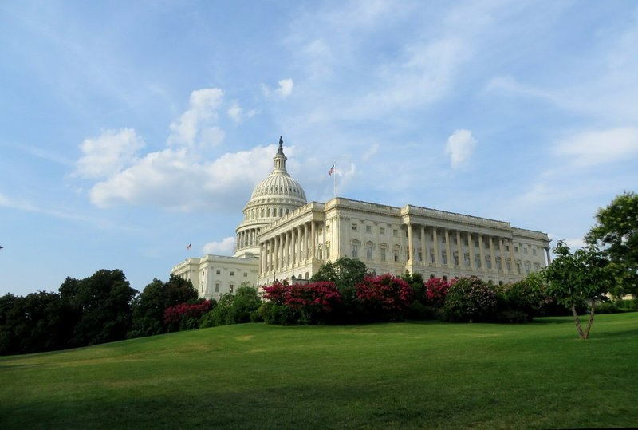
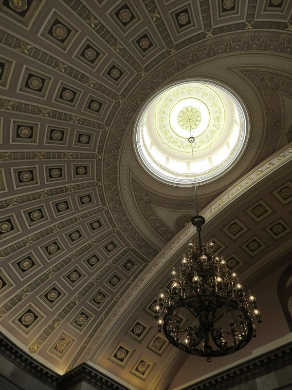
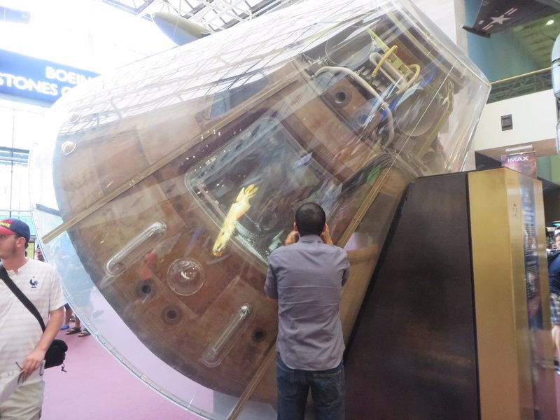
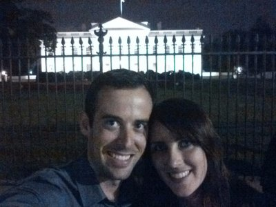
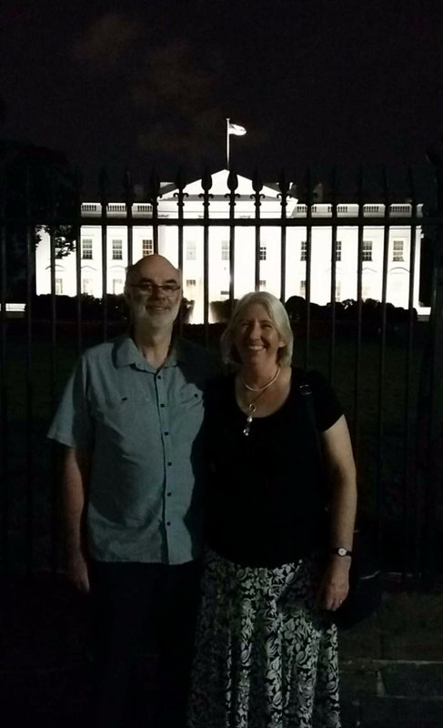
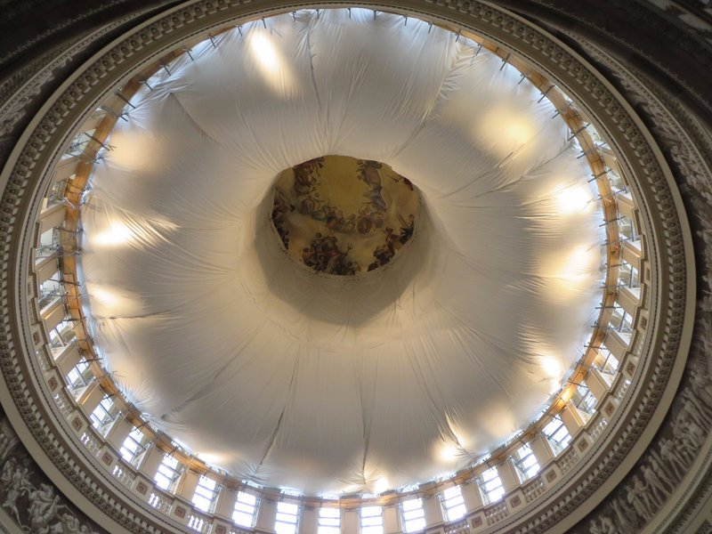
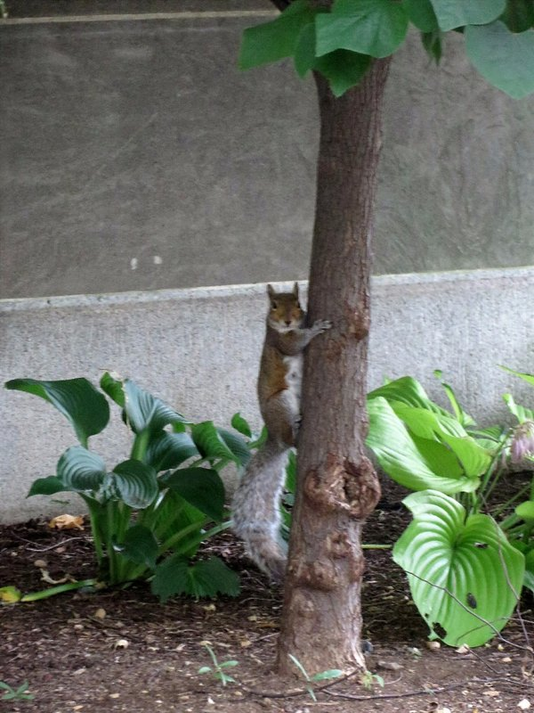

Today we check in on Frank and Clare Underwood! Or the Obamas, or whoever's home. Up and to the Capitol for our tour. We booked a tour online last night and arrived well before our timeslot to navigate security. Actually way more painless than most airports! So we arrived early, but rather than making us wait we got into an earlier tour group.

We started in 'The Crypt', a room under the rotunda purpose built as the entrance to  Washington's tomb. Unfortunately there were a stack of building delays ('War of 1812' they say- sounds like lazy tradies to me!) so by the time it was done in 1827, Washington had been dead 28 years and was already buried. The government came to exhume him, but found his family less than keen to let their decaying grandpa be dug up and made into a tourist attraction. So now it's a room full of statues (13 statues to represent the first 13 states) and no body of Washington.

*I Wish I Was As Photogenic As This Building*

Next upstairs to the rotunda. The fresco on ceiling was obscured by cloth. Running around the base of the rotunda was a fresco of American history and exploration. Apparently the painter miscalculated and accidentally left a 9 metre gap at the end. In 1951, 62 years later, this was filled in by another artist with some modern American history including a panel about the Wright brothers.  There were a bunch more statues displayed here, apparently the collection has 2 from each state (commissioned and chosen by each state). And we're told this is the room famous American's bodies are displayed in before burial, most recently Rosa Parks and Gerald Ford.

The last room looked very French with a huge decorated ceiling that apparently made the acoustics impossible (on top of constant echos, if you stand in the right spot you can hear people on the other side of the room clearly- not great for political intrigue and backstabbing). More statues here including a bunch of the leaders of the Confederacy. Two choices for people who represent you state and that's who you pick. What's with the pride in fighting for slavery guys?

*The Beautiful, Completely Impractical Vaulted Ceiling*

After the tour we went to the Senate, which was in session. A man was on the floor speaking, but within a few minutes of listening to him ramble we realised he must be filibustering. When he finally gave up the floor there wasn't a quorum, and after waiting a bit we realised nothing was going to happen and left. Nice to see the Government in action- most people not showing up, and those that do refusing to let anyone else speak, all in all managing to achieve nothing!

Mum and Dad stayed at the Capitol to check out an exhibit about the War of 1812. We had lunch and got changed at home then headed to the Air and Space museum. All sorts of planes, rockets, and other space vehicles were hung from the ceiling throughout the museum. Talk about Nirvana for Pat! In addition to an Apollo lunar module, the back up Skylab space station was on display with a catwalk in place for visitors to walk through the station and pretend they were orbiting the earth (at least that's what I did).

*Pat Wants To Go In The Apollo Space Capsule*

Banners all throughout the museum alerted us to the fact that the planetarium was showing a presentation narrated by our favourite astrophysicist (Neil Degrasse Tyson). How could we resist? Despite being a bit light on the content (admittedly, it's probably quite difficult to distil string theory and dark matter theory into bite sized chunks that can be understood by the average adult in 8 minutes) the visuals were entertaining. However, as the show lasted longer than 30 seconds Peter has no trouble sneaking in a quick power nap to recharge the batteries.

*Heey!*

Probably our favourite exhibition was a room that was set up like an art gallery containing pictured taken by the Mars rovers Spirit and Opportunity. All sorts of different images of rock formations, hills, valleys, and shots of the horizon looking both oddly familiar and distinctly alien at the same time. We both spent a good chunk of time soaking in all the pictures before moving in.

At some point, Mum and Dad headed back to the apartment to get dressed (what were they wearing before??) while Kate and Pat continued wandering through the exhibits until we were spaced out. To celebrate Peter's birthday/both of them retiring/thanking them for 7 months dog sitting we met up again at Joe's Seafood and Steak Restaurant for a very nice, fancy pants dinner. As a last stop on the way home we took some selfies out front of the White House!

*Jill and Peter go to Washington*

*10% Beautiful Frescos, Presumably 90% Hidden Congressional Secrets...*

*Squirrel!!!*
