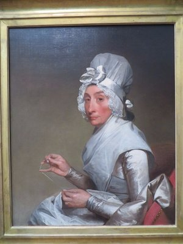
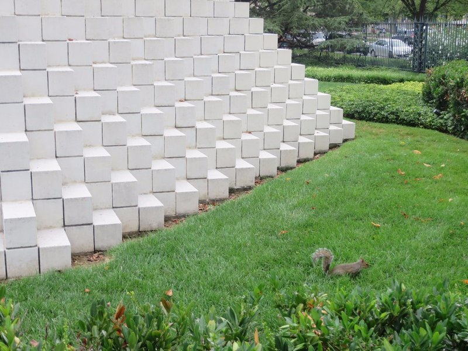
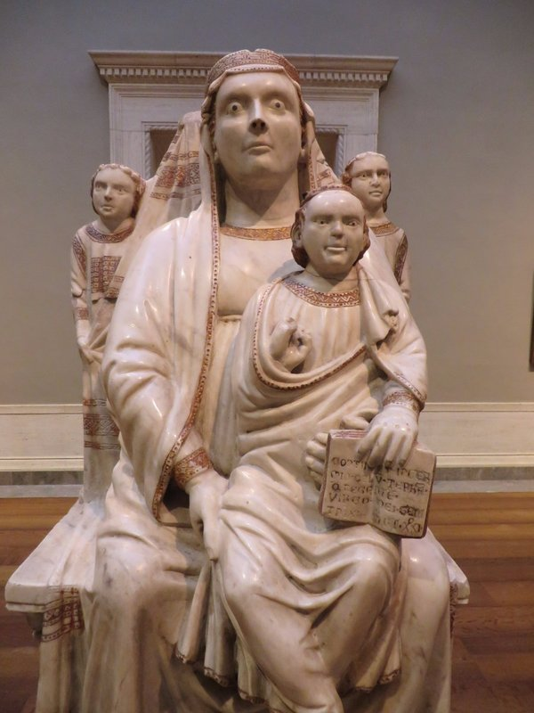
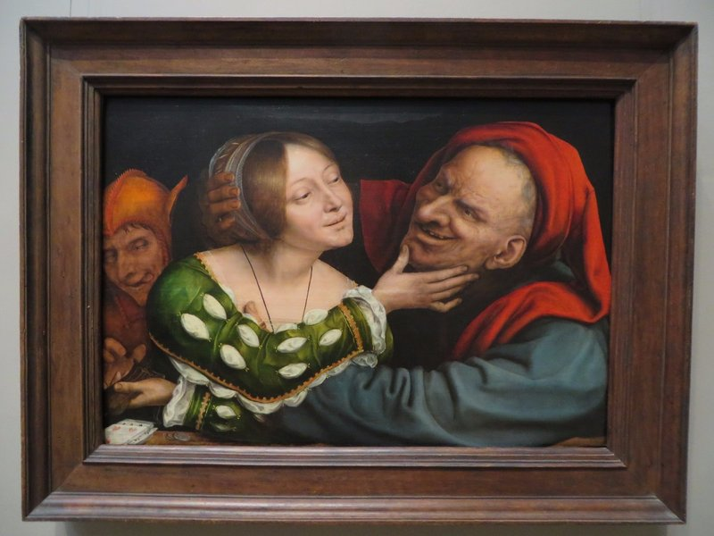
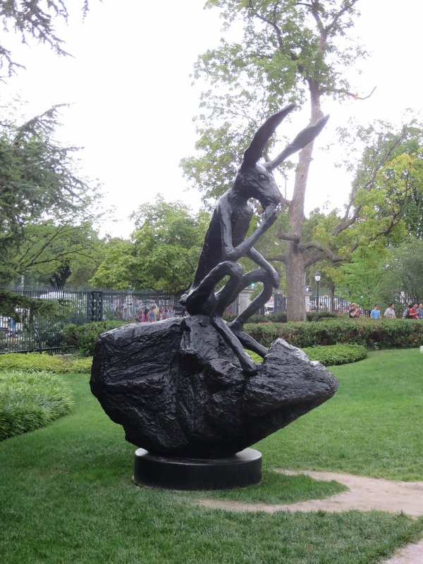

Up, at em, more museums. Today we tried out the National Art Gallery. We started in the Italian art where we were proud that we were starring to recognize the different styles and artists more without using information signs. Next was the Flemish gallery, we were transfixed for quite a while by Rembrandt's 'The Mill'.

*Kate's Favourite, Reminds Her of Lady Catherine de Bourgh*

The American gallery started as quite a disappointment- the paintings were  much lower quality than the previous displays, but they improved as we progressed. I guess when The New World was settled in perpetual war, painters didn't think 'what an opportunity! I'll emigrate!', the paintings were probably by hobbyist, self taught farmers and labourers.

The last gallery we had energy for was the impressionist- this museum could give Musee d'Orsay a run for it's money in terms of quantity. Heaps and heaps of paintings by Matisse, Monet, Degas, Van Gogh and others. They had a very sad series of paintings by Monet showing the change in his paintings as his eyesight deteriorated to blindness, and an interesting display showing the massive change in the colour of Van Gogh's paintings through time and exposure to light.

Feeling we needed some exposure to light ourselves we exited into the Sculpture Garden. Everyone was climbing on everything to take photos despite signs all over the place saying not to. First world anarchists.

*He Can Climb On The Art If He Wants, I Won't Mind*

We took the metro to Pentagon Fashion Center and had afternoon tea and a look at the shops, then headed back to Eastern Market. We explored in a different direction away from our flat and found a nice bar/restaurant to have dinner. The waiter started by warning us they didn't have any burgers. We tried ordering something else and he said 'oh, none of those either'. Pat asked what they did have and the waiter replied 'ah... Well... Nothing actually...'. Mum looked very distressed until he explained it was just a joke. We got her some wine and she felt better. We all left our last dinner in Washington well fed and well wined.

*Michael Jackson's Holy Inspiration?*

*An Accurate Representation of Our First Meeting*

*I Guess After Donnie Darko The Rabbit Came to Washington*

Trippy Stationary Sculpture. It's really not moving
