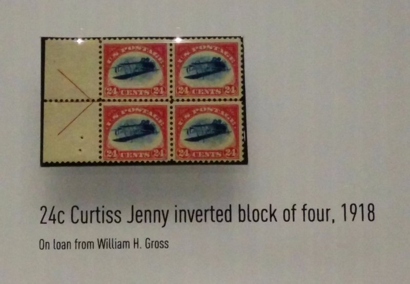
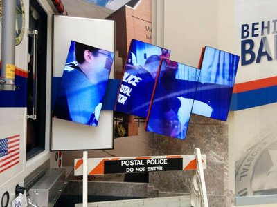
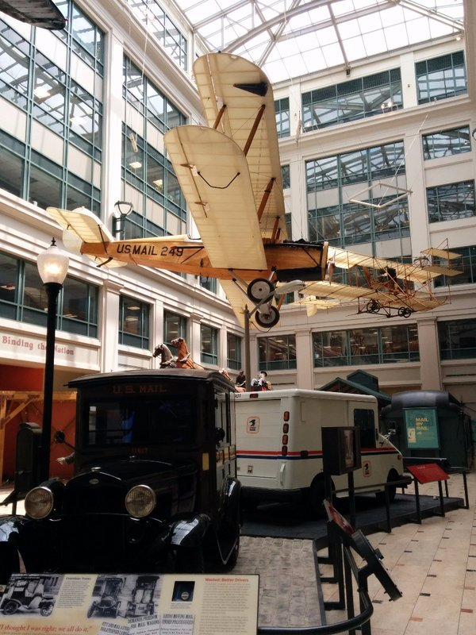

A late start, then a trundle to the station, luggage in tow. Kate is jealous of her parents' rolling luggage. At the station we decide to dump the bags in lockers for the few hours before our departure. Some investigation revealed the locker system, and it's worse than Italy. Terribly expensive and run by a few people behind a counter. Why this can't be automated is a mystery. But we have learnt to shrug, empty our wallets and accept the world doesn't run in the efficient perfect way it would if we were in charge!

We spend our free time in the Smithsonian Postal Museum next door. More interesting than it sounds! The first gallery was all about stamps. They told an interesting story of a famous misprinted stamp of an upsidedown plane- the Inverted Jenny. The postal system were using a fancy technique of two colour stamps by stamping the paper once with a red border, then a second time with a blue plane. And disaster!! One 100 stamp page got out with the blue plane printed on upsidedown! What folly!

*Inverted Jenny*

A (presumably dapper) gentleman William Robey bought the page and realised what  a stamp collector's goldmine he had. He asked the lady at the counter if she had any more misprinted stamps, at which she realised the ones she sold him were upside down and tried to take them back. William refused, and was then faced with harassing calls and home visits from the federal post people trying to buy them back. He started hiding them under his mattress while he looked for a buyer. He eventually sold the lot for $20,000, which at the time was enough to buy him a house and a car and have some left over. The stamps were separated and sold and resold, most recently a set of four were sold in 2005 for $2,970,000! I need to get into stamp collecting.

*The Post Police- A Very Dramatic Video*

There were collections of historic letters including some from the Titanic and letters from people in Italy when Napoleon invaded. They had a section on mail transport showing the evolution of the postal van- one particularly clever design so fragile dogs could knock them over was abandoned quickly. In the 'evolution of the postal system' section they had a video of four old men who worked on trains sorting and delivering mail from town to town who were made obsolete in the 70s. Put in the room they used to work in they all could still do their old jobs as fast as ever. I hope they found other work in the intervening years, it really would be gut wrenching to have your profession just disappear. And for Pat there was a section on mail in space.

To the station, to lunch. Mum had trouble ordering coffee when she and the barista couldn't understand each other, despite both speaking English. Dad was accosted by a man telling him the station was bugged and all his conversations were being embellished and put on the Internet. Sounds like it's a good time to move on to the next place... It was absolute chaos boarding the train. For whatever reason, we have to wait at a gate, not at the platform. The gate isn't anywhere near big enough so people queue out into station blocking all foot traffic. Because seating isn't assigned and people want to sit together there's a bit of elbowing and sneaky pushing in ahead. When gate opens, the late arrivals start pushing in at the front so they're not stuck separated. When we got to the platform, only 4 carriage doors are open despite it being a very long train, so everyone is crushing to get in and unable to get to luggage storage (located conveniently adjacent to all the doors the staff failed to open) so hundreds of people are squeezing though the narrow aisles, thumping into people already seated with big suitcases (or in our case backpacks), still racing to try to get seats with their friends. It's disorganised and chaotic; as bad as some of the worse places in Europe. But in the end we got four seats together and the 3 hour journey was pleasant. Even had WiFi!

In New York we navigated our way out of the station past all the repair work, joined a queue for a taxi, and got to the apartment (found through Air BnB- pretty decent for the price). A quick pie and hamburger dinner at a local bar and time for a snooze.

*Post Patrol*
