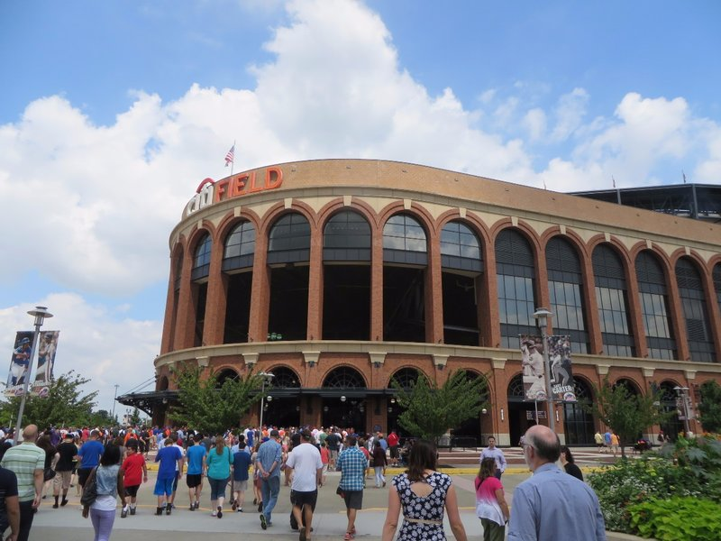
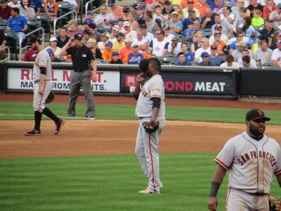
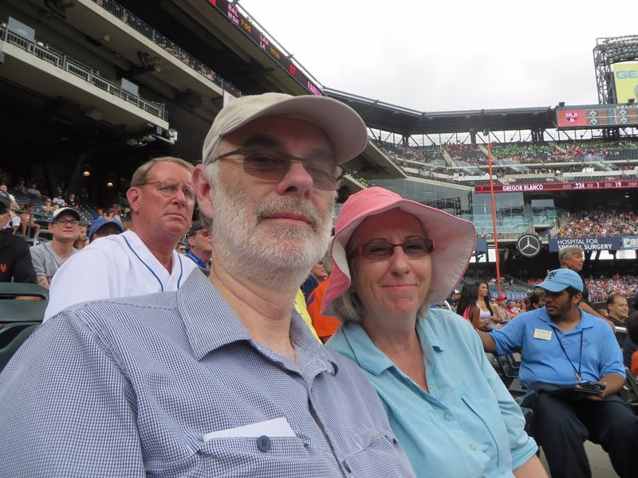
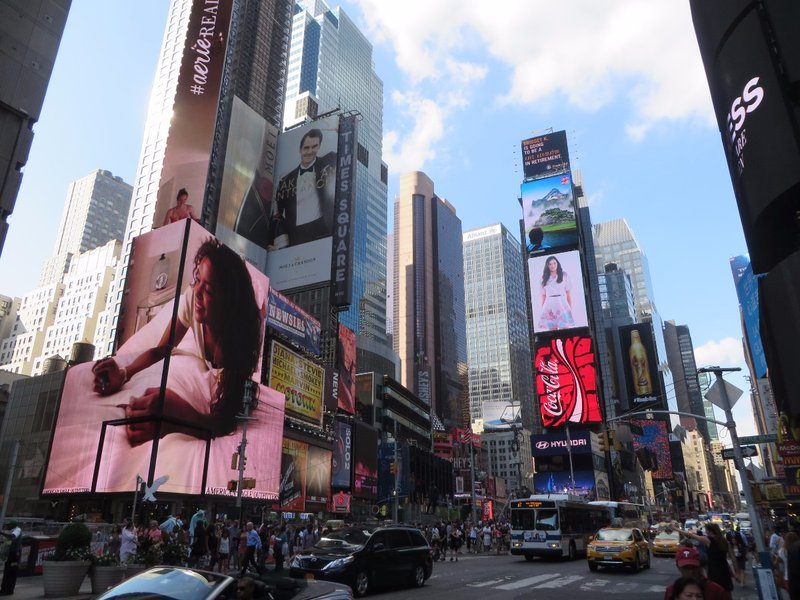
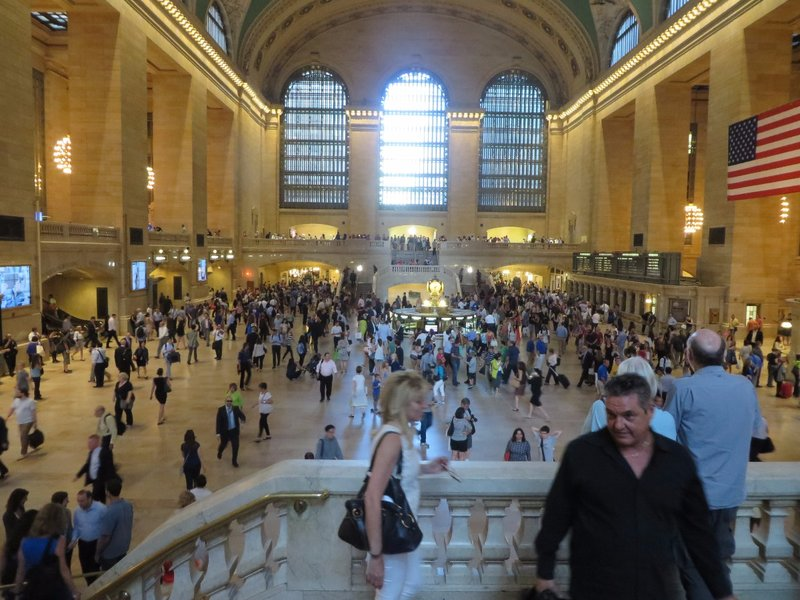
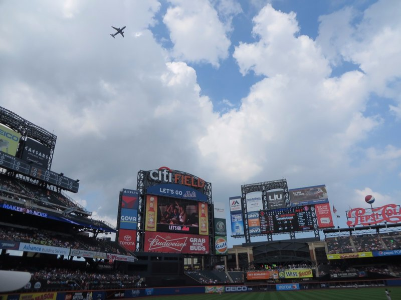
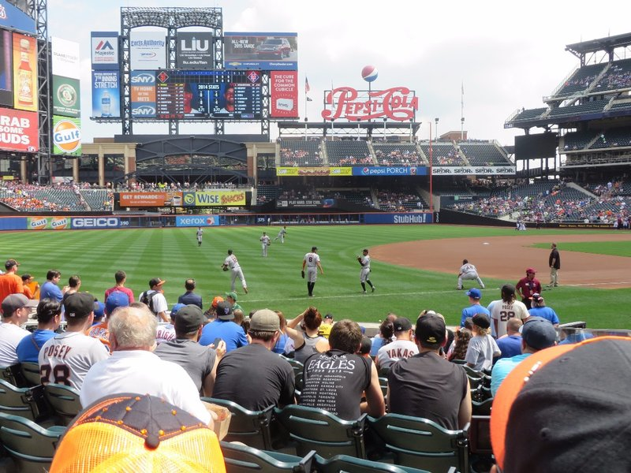
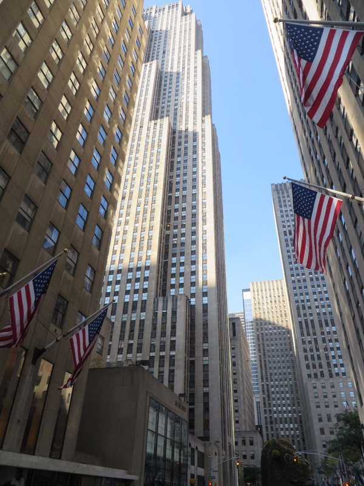
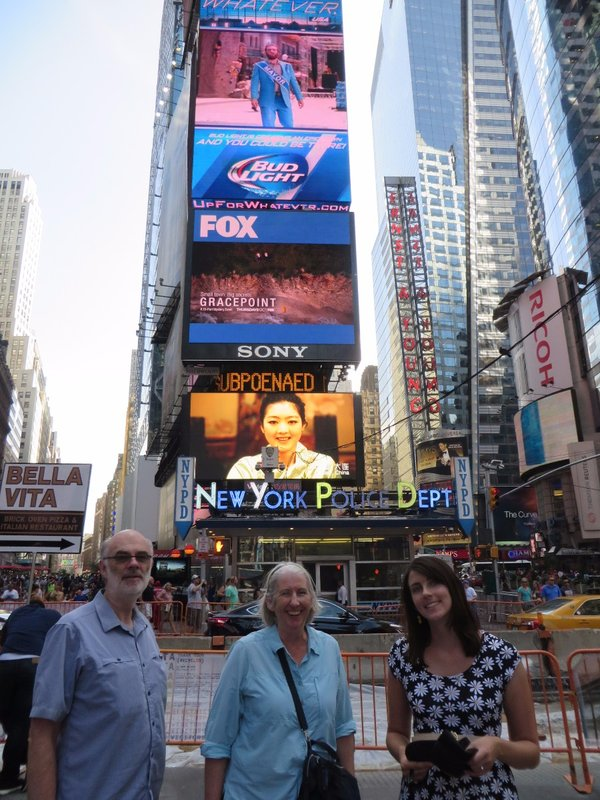

Pat and I started our day feeling like real New Yorkers with a jog in Central Park. Despite this being the biggest city in the USA, we run into Mum and Dad in the park. It's a small world! To get to Central Park we got to weave our way through all the New York business people, rushing wherever, coffee in one hand, mobile in the other. Excellent. In the park there were many dogs being walked, all were like the dogs you see in Europe- very well behaved leaving strangers and other dogs alone. It seems the more dog friendly the city, the better the dogs. We wonder if the dogs are trained better because they're allowed in cafes/offlead/etc more, or if they just get less excited by things because they have more freedom.

Back at the apartment, we get ready and take the metro to Citi Field to watch the Mets host the Giants, a gift courtesy of Steve and Mary! We managed to get some great seats along the third base side just past the infield. According to Pat's rules, a baseball game doesn't count unless you eat a hot dog or a sausage at some point during the game. So of course, we sampled the stadium's offerings and found them to be quite satisfactory. Quite satisfactory indeed!

*Citi Field, Another To Tick Off Pat's List*

The game was very close and went right down to the last inning. Pablo Sandoval (who, side note from 2015 when we're finally posing this, sadly played his last game as a Giant in 2014 as he moved to the Red Sox this off-season) had an incredible game as he drove in three runs with three hits, including the go-ahead run that proved to be the game winner with two outs in the top of the ninth inning. The Giants ended up winning 4-3, mostly off his efforts.

*Shy Panda*

One of the more amusing trends we noticed during the game was a series of posters fans had made with vague insults(?) directed at Giants right fielder Hunter Pence. A couple of our favourites were:

"Hunter Pence thinks Game of Thrones is just OK"   
"Hunter Pence bedazzled his cell phone"

As far as insulting posters go, they're incredibly good natured and we both agreed they were worth a chuckle at the very least.

*Jill and Peter's First Game*

After the game we took the train to Times Square, which was, as you might expect, packed! In addition to a squillion people, there were renovations or road works or something going on right in the middle of a lane of traffic, forcing construction workers to keep the hoards of pedestrians away from the massive holes in the ground and away from the heavy machinery that was quite capable of squishing anyone who accidentally wandered too close. We decided the crowds were all a bit much so we went off in search of a coffee to keep us up and running!

*Roger Federer Bringing Some Class to Times Square*

We stopped at the first place we saw off Times Square, too overwhelmed to be picky. On sitting at the table the rude waitress informed us to keep our seats in the empty establishment, buying a drink was not sufficient! We had to buy food as well. And NO SHARING or there's an extra charge. We got two slices of (delicious) New York Cheesecake between the 4 of us, then shared it when she wasn't watching sneakily using the coffee teaspoons. At the end of all that, we were forced to pay a mandatory 20% gratuity. I guess that's why she felt comfortable being so unpleasant. At least the forced cake was so yummy!

Feeling recharged, we continued our walking tour back to the apartment, admiring 30 Rock, Grand Central Station (took a 'Spotted at Grand Central' snapchat of Kate ala Serena in Gossip Girl) and the UN building on the way. We grabbed a late, cheap dinner from grocery store to make up for the expensive cheesecake and called it a day.

*Spotted at Grand Central, Bags in Hand...*

*Sneaky Passengers Getting a Sly Game in for Free*

*Nice Seats*

*Can't Quite Remember What Country This Was From- Needs More Flags*

*New York, New York!*
