First up today we need to get a New York Pizza. Apparently the best to be found are in Brooklyn, so we get the subway across the bridge and go investigating. We walk past a number of brownstone houses that could belong to Dan Humphrey with Kate saying "spotted!" and "xoxo" intermittently until we reached Table 87. Totally worth the walk. The pizza was definitely the best we've had in the USA so far. Nice thin crust, not too crazy with the quantity of toppings, giant slices, and a surprisingly delicious coffee to go with it. Not quite Naples, but pretty bloody good.

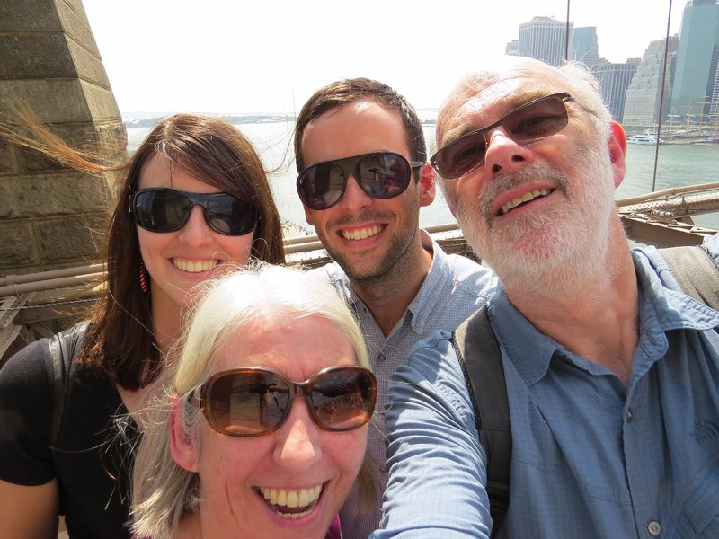

*Selfies on the Bridge*

Once we were full we headed back towards Manhattan. We decided to walk rather than subway and trotted over the Brooklyn Bridge. The views of Manhattan looming were fantastic, the bridge itself is beautiful, but it's hot as hell and we're a little relieved when we get to shade on the other side. After a brief interlude watching break dancing buskers who kept building the crowd promising amazing feats, but never delivering, we headed through the Beekman area of town towards the wharf.

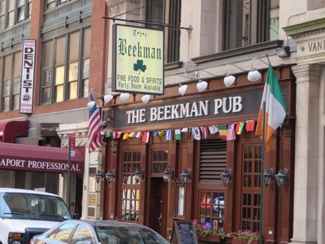

*Beekman Owns This Town*

While waiting for the ferry, Pat wandered off to look at the helicopters taking off and landing from the next pier over and thought he might grab a quick picture. Diligently looking at the display on the camera trying to get the best shot, he overlooked the concrete bench that he was quickly approaching. While everyone else was conveniently (and thankfully) queued up facing the other direction waiting for the ferry, Pat walked full speed into the bench smashing his leg ("cause he's stupid", Kate adds) and stopped just short of going head over heels. Quickly regaining his composure, he walks nonchalantly back to the queue and joined the rest of the family without incident. Unfortunately, the massive lump on his shin was a dead give away of his folly.

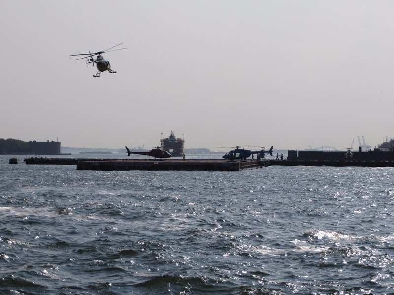

*The All Important Helicopter Photo*

As recommended by Angelina and Eric from Recife, we took a ferry across the bay to New Jersey, passing the Statue of Liberty on the way. Thanks for Jerry and Paula for this excursion. On arriving in New Jersey we were greeted by a giant pile of garbage. Seemingly New Jersey is literally a trash heap. Think they could make it more welcoming...  Rather than getting off we stayed on board and enjoyed the views of Manhatten on the way back over.

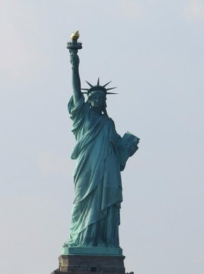

*Next to French Fries, France's Greatest Gift to the US*

We walked down Wall Street to the 9/11 Memorial. It was a really beautiful memorial with some spectacular fountains and an attached museum. However they charged a very large fee to actually go into the museum ($24/person). Nowhere else we've been in the world have they charged more than a token amount to go to a memorial museum. Usually they want to encourage people to visit, regardless of their socio economic status because they want people to learn about the tragedy and remember the victims. Here they seemingly want cash... There's even a gift shop if you want a 9/11 Memorial baseball cap or Twin Towers tote! It all feels a bit tacky and morbid to us so we opted to skip the museum.

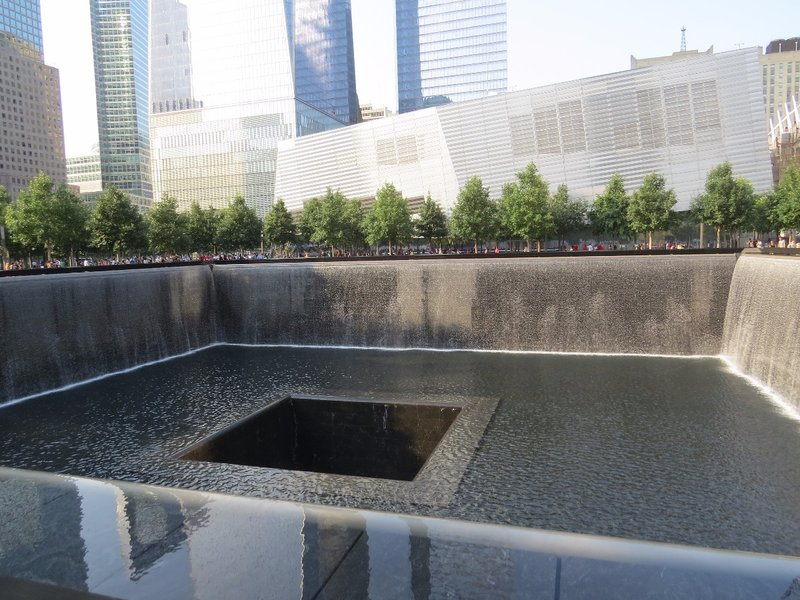

*One of the Reflecting Pools at Ground Zero*

From there we walk up Broadway and 5th ave towards the Empire State Building. We pass a restaurant along the way boasting Mexican sushi and Japanese tacos. How could we resist. It wasn't bad, but we don't think this particular fusion will catch on. On we go as it gets dark. The Empire State building is huge and difficult to see and photograph because everything around it is also huge, but we do our best. We had been planning to go to Top of the Rock tonight, but with Pat's enormous haematoma looking worse and worse we decide to head back to the apartment for  some wine, peanuts, and chocolate before calling it a night.

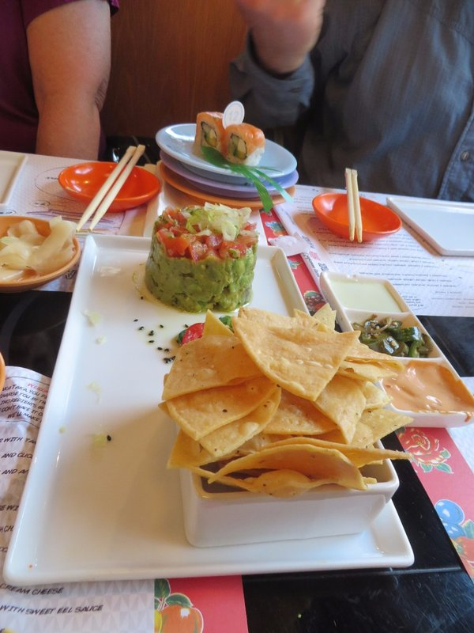

*Avocado Sushi Thing*

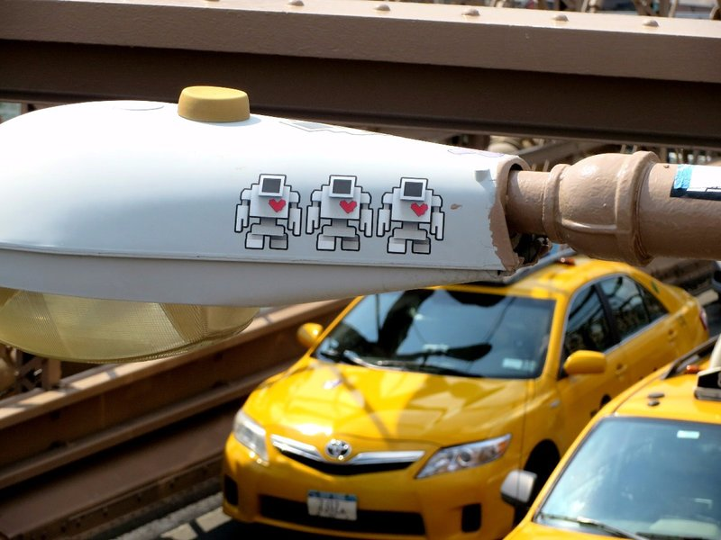

*Cool Brooklyn Bridge Art*

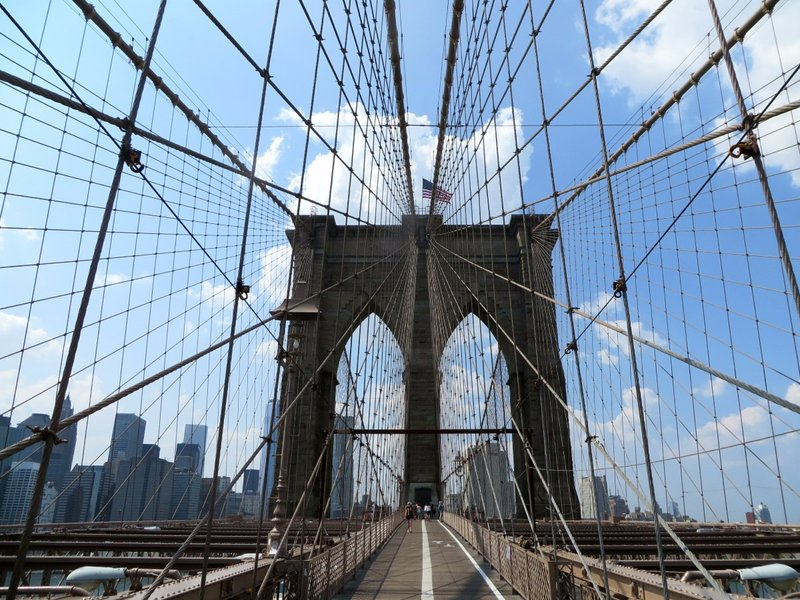

*Yeah, I'm Out That Brooklyn*

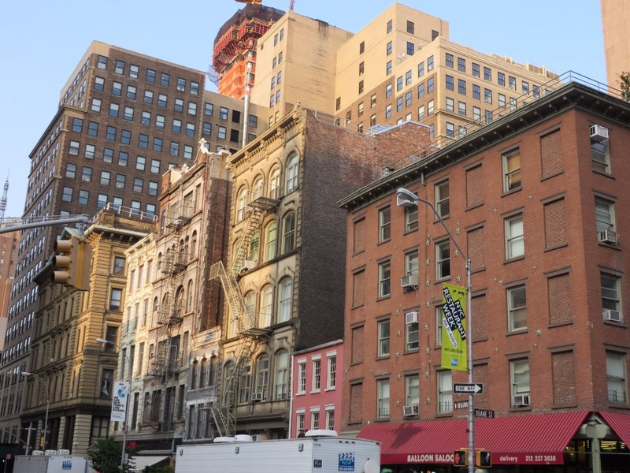

*Now I'm Down In Tribeca*

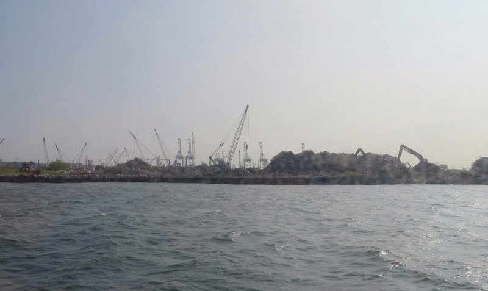

*Can See Why Jay Z Didn't Sing About Jersey!*

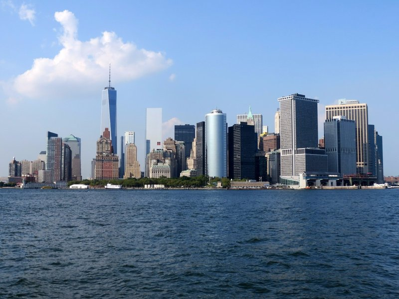

*Manhatten From The Bay*

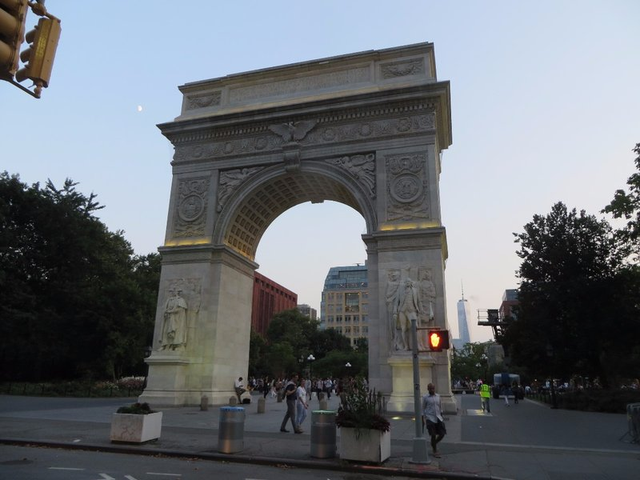

*Washington Square Arch*

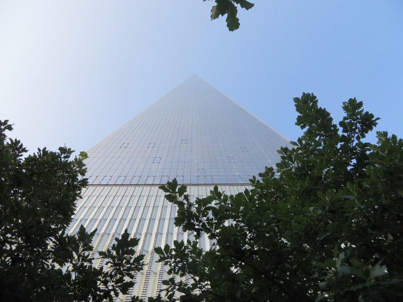

*Sneaky Building Looking Infinite*

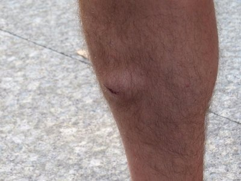

*Ouch*
