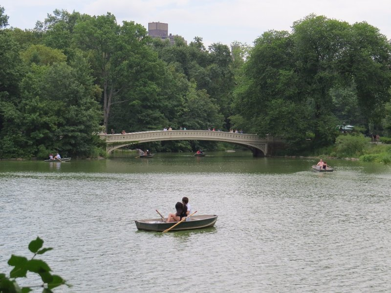
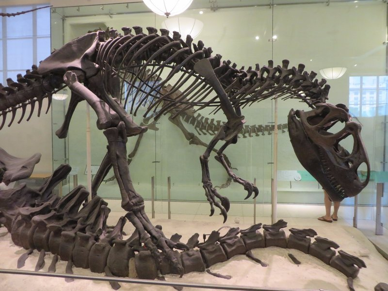
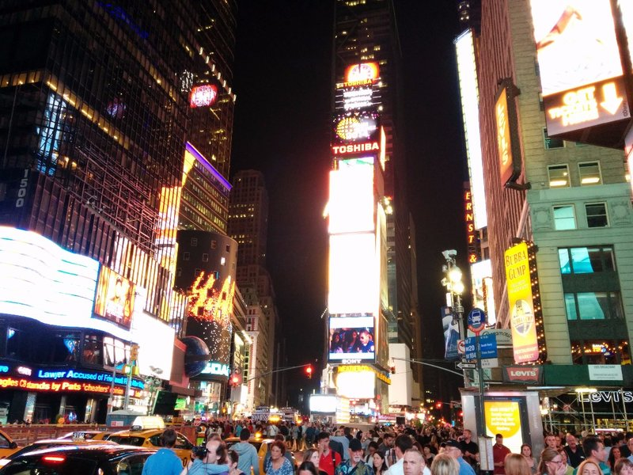
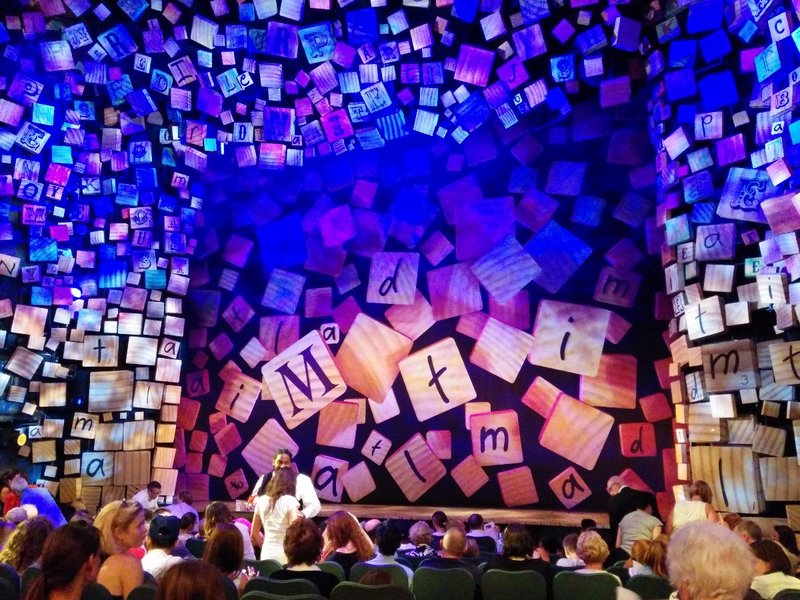
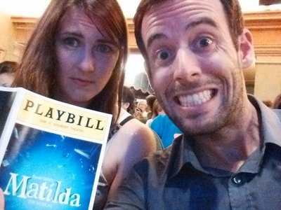

Up at a reasonable time for our jog. We weren't sure Pat would actually be able to jog with the heamatoma in his leg, but thought we'd at the very least have a walk to Central Park and check out the line for Shakespeare in the Park tickets. John Lithgow and Annette Benning are performing King Lear for free this week, but you have to queue for limited tickets the morning of.

In the end we did manage to jog, but in completely the wrong direction so it took an hour to find the theatre in the middle of the park. The queue was astronomical! A lot of people with chairs, blankets, picnic baskets of food... We stopped to ask some people at the front how long they'd been waiting- apparently since 3am.

Nope.

*Dumping a Body in the Lake?*

Having decided we'd see Shakespeare another time, another place, we decided on what to do with the day. On the way home we tried to sort out an issue with our AT&T SIM card as we were unable to use mobile data. Pat stayed very calm speaking to 'Kevin’ and ‘Rex’ at AT&T with conversations like-

Rex- Can I have your postcode?   
Pat- As I said, I'm here on holidays so I don't know the postcode. I'm in Central Park, New York City  
Rex- Well could you look it up for me?  
Pat- I'm actually in a park, and like I said I don't have any data coverage. That's why I called.  
Rex- Oh, right. Well maybe just Google it then?  
Pat- ......... Ahhhh!!!

After an hour of this they gave up and concluded cellular data in Manhattan must be down with no estimated time it'll be back. Apparently we're to believe one of the biggest networks has no coverage in the biggest city in the US, AND there’s no information on their website, their Twitter page, their Facebook page, or anywhere else on the Internet and apparently it’s not enough of a priority to even have an estimate for when it will be fixed. Nice.

Ugh.

*Sharptooth!!*

After giving up on AT&T we headed to The Natural History Museum where we met Jill and Peter. First the dinosaurs. Very cool skeletons, but also a lot of noise and kids and crowds. We also learned they found platypus fossils in Argentina!  We couldn't really handle the crowds so Kate and I ended up down in the geology area learning about the formation of the earth and atmosphere, earthquakes, volcanoes, Aurora Borealis... The exhibits hadn't been updated in decades and a lot of the lights had blown so it wasn't always easy to read the information, but with no one standing in front of any signs or speaking loudly or taking selfies we didn't mind. Before we knew it, it was time to leave!

We grabbed an amazing dinner from a supermarket down the road, it was stocked with a fresh cooked selection like Japan! The four of us then walked to Times Square, all lit up, to see our first show on Broadway, Matilda. The show is written by Tim Minchin, based on the Roald Dahl book, tickets care of Brett and Carey. The show was sold out with quite a few little kids in the audience. The performance was very very energetic, very talented children in the cast and chorus, great song lyrics, very amusing all around. A bit too scary for some of the younger children in the audience, I was surprised to see toddlers there to be honest.

Having avoided being killed by trucks or horses in Times Square on the walk home we grabbed a slice of pizza, then had a quick dessert and an appletini at The Smith, a bar around the corner from the apartment.

*Times Square At Night*

*Matilda!*
