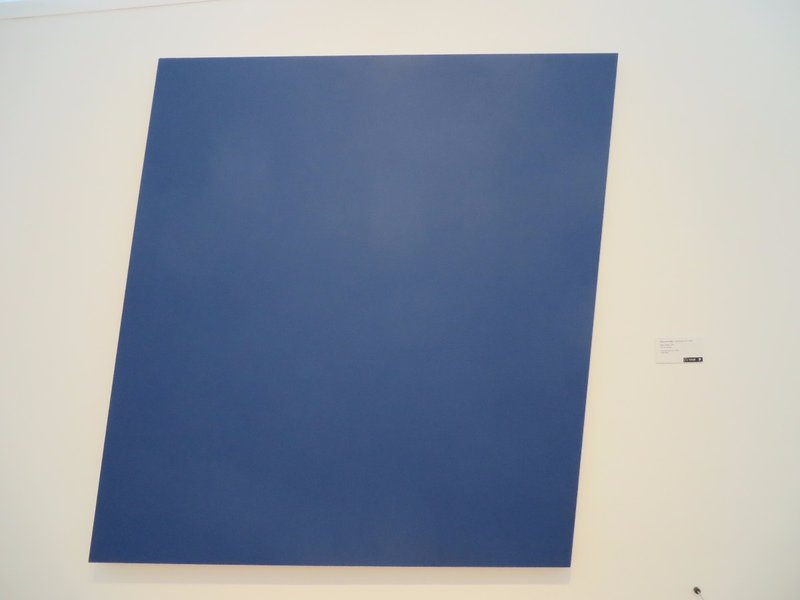
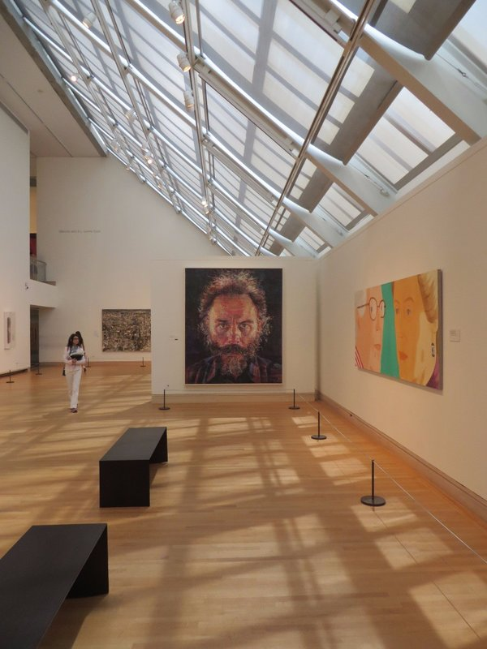
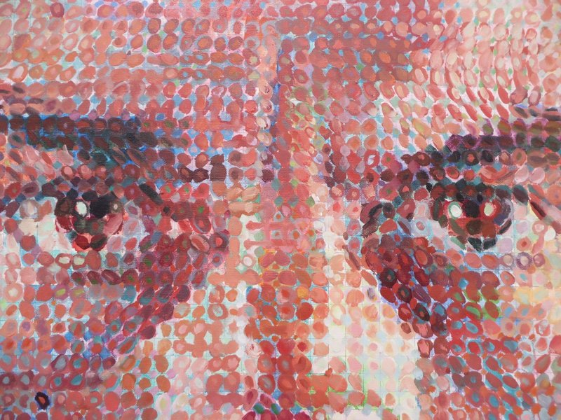
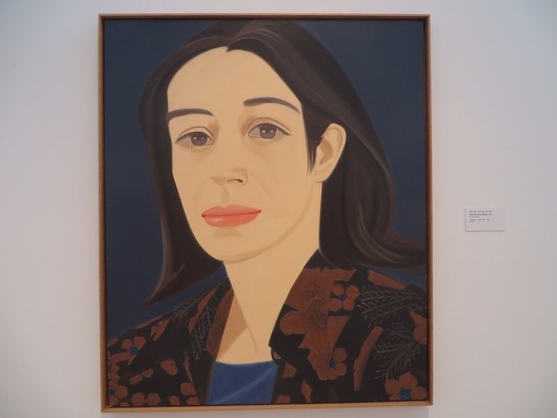
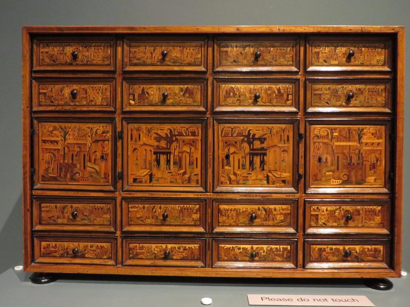
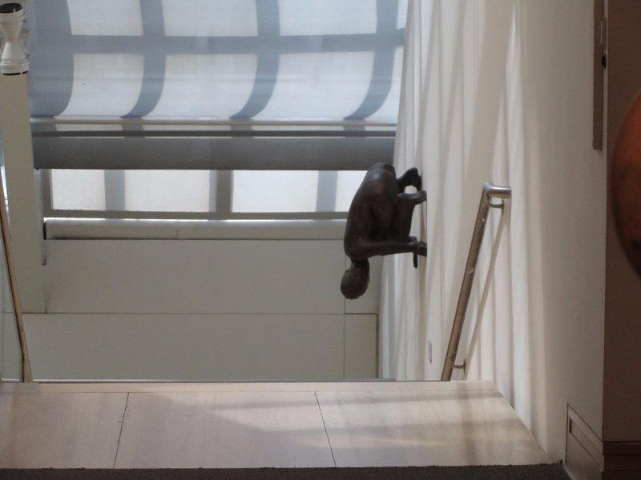

Jill and Peter went off to the Met bright and early while Kate and I slept in. We made vague plans to meet them there later on.

Once we woke up, we took the subway uptown and had a little walk through the Upper East Side (didn't see Blair or Serena) and grabbed a slice of pizza before heading into the Met. Also, complete devastation, the steps to the Met were closed for renovation so Kate couldn't pose sitting on them with a headband.

To start we grabbed an audio guide and headed to the Modern and Contemporary Art section. Not too busy, a few pieces we each liked.

*Ellsworth Kelly, Blue Panel.*

Pat thought this was stupid and meaningless until we heard the artist on the audio guide say people were always asking him what it meant and that it was a shape and it was a colour and they pleased him. I guess if we're just doing stuff that's pleasant to look at, not getting into allegories for the factors in the Austro-Hungarian Empire influencing the start of World War I, then it does alright by us. It *is* a nice blue!

*Chuck Close, Lucas I. From the other side of the room we were sure it was a photo, but as you got closer...*

*Huh*

*Alex Katz, Black and Brown Blouse. She just has such a sad, questioning expression. She stared at us all the way around the gallery, so disappointed in our life choices.*

Pat was getting a bit over art museums by this point so we focused on non-painting exhibitions for a while. There was a whole area of the museum dedicated to period rooms. They had a number of French rooms that were shipped from hotels and private houses in France, complete with furniture, wallpaper and windows. They had lights set up outside the false windows to give an impression of how the room would have been lit naturally, and some had period appropriate scenes set up. Very cool. There were some British and American rooms and furniture too which we explored. Pat spent a lot of time admiring the woodworking and cabinetry. We imagined what we'd have to furnish our imaginary house with our imaginary money.

*We Can Probably Throw Something Like This Together From Ikea?*

In the afternoon we decided we really had to have a wander though the impressionist section. We sped through the uber crowded gallery until they kicked us out at 5:15.

After some dinner Pat and I headed out and met up with Eric and Angelina, our roomies from Recife, in the West Village and had a few drinks at a place called the Blind Tiger. They had heaps of beer on tap, and one cider. We were worried it might be awkward, but ended up having a really nice catch up with them. Angelina reminded us she actually works at the Met and we cursed ourselves for forgetting! We ended up leaving around 1am to catch the metro back home. On the ride a crazy lady yelled at Kate, then scared another couple so badly they ran off the train to change carriages at one stop to get away from her. Oh New York!

*Creepy Modern Art Crouching On The Wall*
