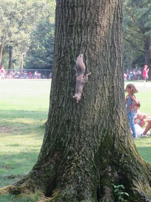
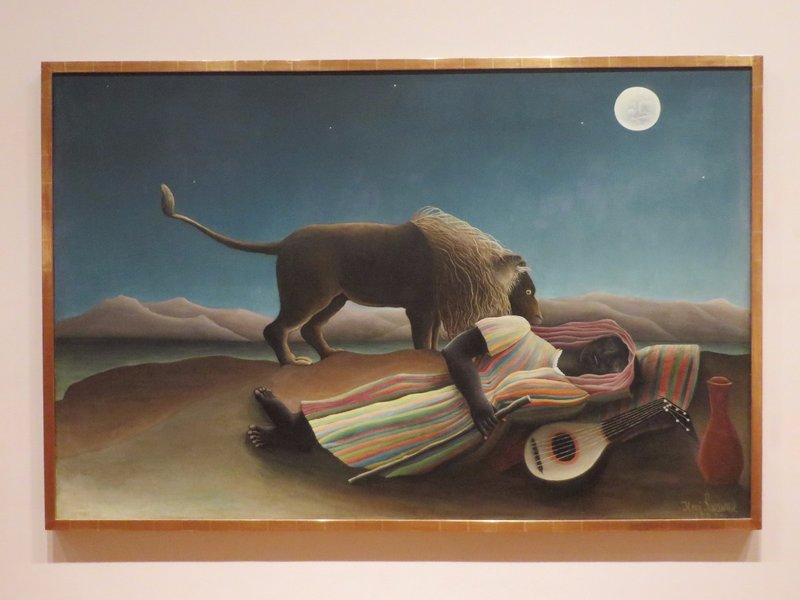
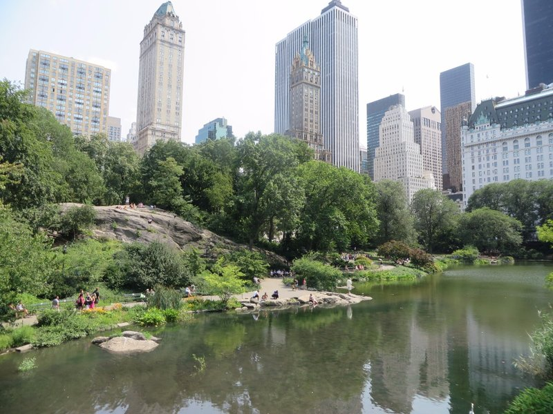
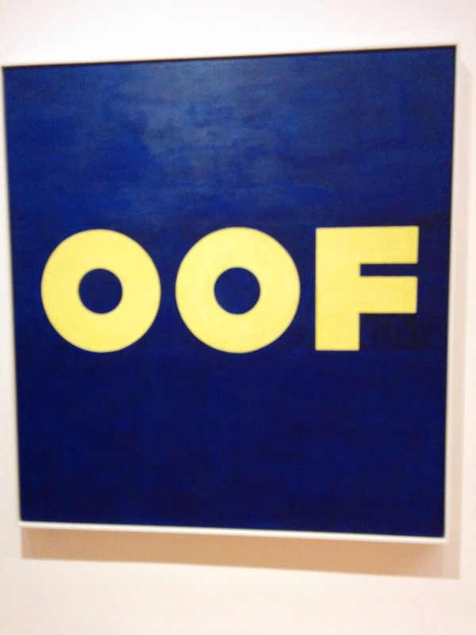
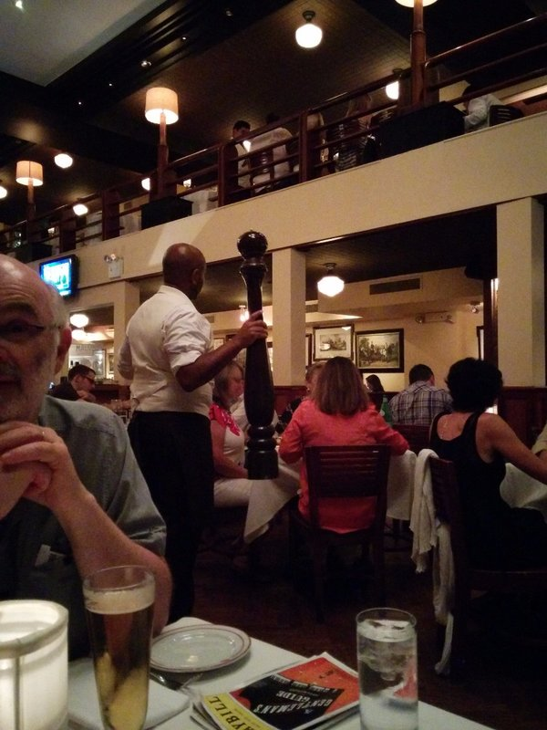

We had another sleep in after getting home so late last night. Jill and Peter came back to the house from a trip to Bloomingdales shortly after we woke up. Peter declared it terribly boring . He says even in the electrical section the most interesting thing was a mix master because they looked so retro. From there they were heading to the MoMA while we were going to wander around town aimlessly until the museum was free from 4pm and meet them there.

We stopped and had a nice lunch at a 'design your own pasta' place, then walked towards Central Park stopping at a few department stores for Kate to window shop. We didn't find anything actually worth spending money on, so we walked on through Central Park stopping to watch some men in business suits doing aerobics and yoga, and some softball games along the way. Pat thought he'd like to join a team when we get to Canada. Every time we go through central park it seems that things are in different places. Things you once recognised are gone and have been replaced by new foreign items.  I reckon it's actually alive and moves around at night when it's closed just to screw with everyone.

*Well... Pat Watched Softball. I Watched Squirrels.*

After a few hours we stopped for some sushi and a philly cheese steak to top up our bellies before going to the museum. We ended up arriving there around 3:30 and found a massive queue. Guess there's a lot of cheapskates with the same idea as us! Luckily they started letting people in quite early and the line itself moved along quickly so we were in before 4:00. There were a couple of special exhibitions. The one on Toulouse-Lautrec (the guy who painted the Moulin Rouge dancers) and one on Jasper Johns (an American painter) were quite interesting as we'd seen a lot of their work at other museums around the world. The special exhibitions on a couple more modern artists (a graphic designer Ray Johnson and a photographer Christopher Williams) were good also, but not quite as interesting without any background.

INSANE amount of people (guess free entry will do that). We found, even after all this time looking at modern art, and even with a free audio guide, we still don't get some of the "artwork". At all. After a big chat about art with Angelina last night we were ready to be open minded and experience it, but... Shrug. At one point we were in a gallery with a blank white canvas on one wall, an apparent table in the middle of the room and a fire exit door between the two that we almost mistook for another piece of art. To be fair, it was probably better constructed than either of the other two. There were a load of more famous paintings too, we saw Starry Night (from behind 35 other people taking selfies with their DSLRs), and several other works by Warhol, Picasso, Dali and a few others.

*Familiar From The Simpsons Maybe?*

The crowds meant we went through pretty quickly, so within a couple of hours we were ready to meet my parents and head off. We went towards Broadway for our show tonight - A Gentleman's Guide to Love and Murder, a melodramatic, musical comedy about a serial killer. On the way we stopped at a bar to use the bathroom and had to have our IDs scanned and be fingerprinted to get in. The show wasn't quite as funny as Matilda, but still very amusing and a fun night. The theatre was fairly small compared to some of the others we've been to recently, so the intimacy was nice. But it was freeezing so it was almost a relief to get out!

On the walk home we thought we would give Top of the Rock a try, but by the time we got there they were all sold out. Settled for dessert at a nearby restaurant before bed instead.

*Despite Changing Daily, Central Park Was Not As Big As We Expected. Hard To Find A Spot Where The City Wasn't Visible*

*I'd Hang This On My Wall*

*Cracked Pepper?*
