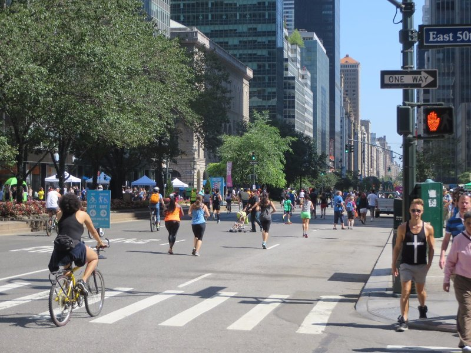
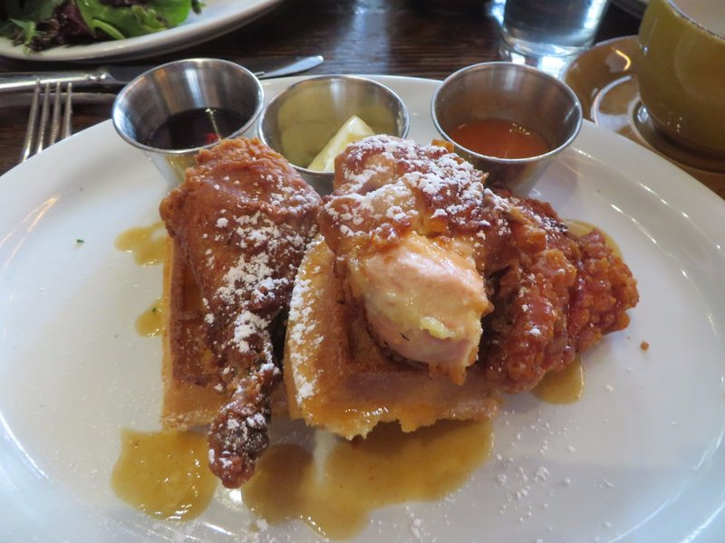
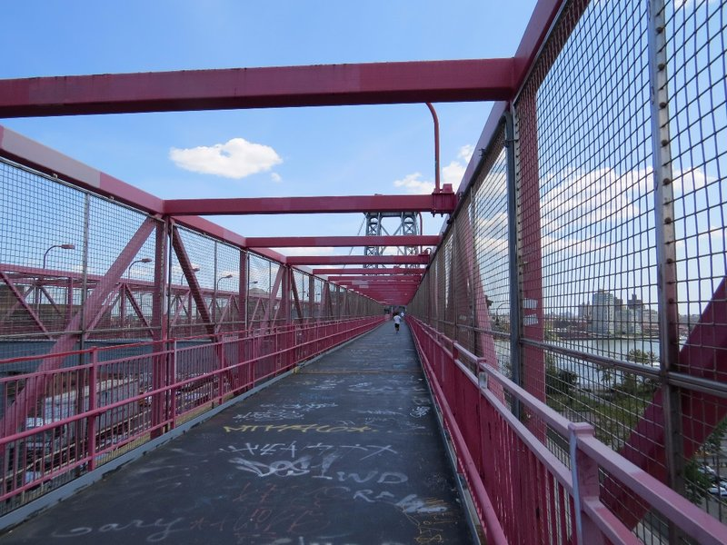
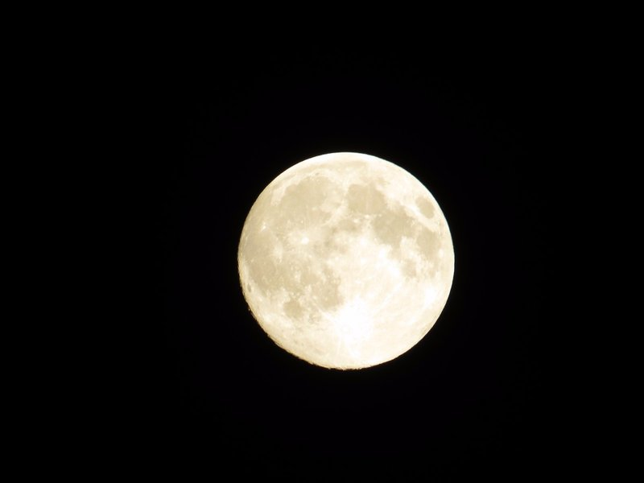
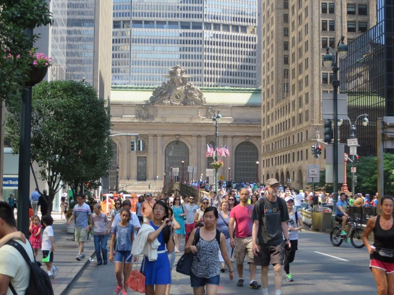
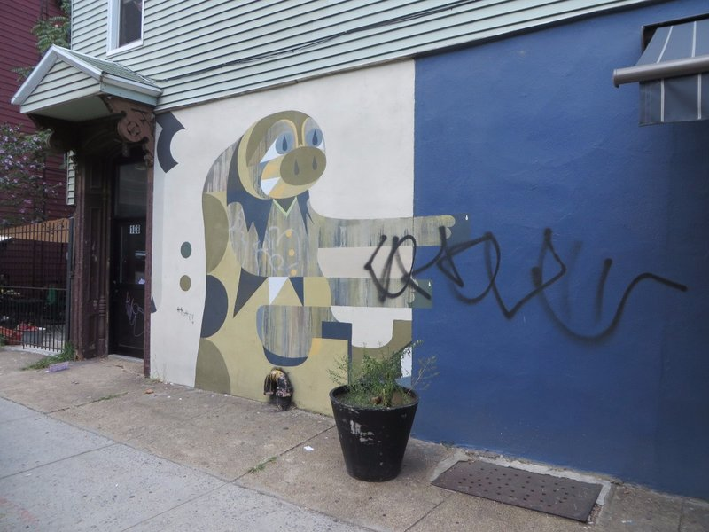
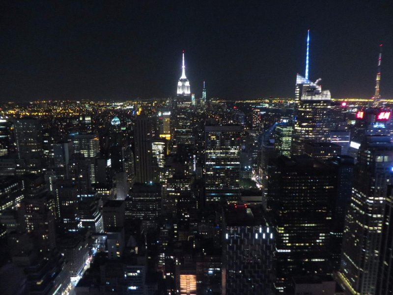

On an especially cool run this morning we got to jog down Park Ave which is closed for Summer Streets. Only pedestrian and cyclist traffic is allowed this morning, an event that occurs three times each year. Glad we caught it! We walked through a big car only tunnel and felt special to be some of the few pedestrians who get to step foot in here without being hit by oncoming traffic.

*Nice To See The Foot Traffic In Charge*

After our run we went further South to get brunch at at Bleecker Kitchen & Coat with Jill and Peter and their friend from Vet school, Jane. Pat couldn't resist the chicken and waffles, something that had been taunting him on breakfast menus since we started this road trip. Much to his dismay, they were only okay. In isolation, the fried chicken was good and the waffles were good, but neither one was markedly improved by its proximity to the other. Kate went with her standard brunch order of Eggs Benedict, but given we're in the city that INVENTED Eggs Benedict, the hollandaise sauce didn't live up to expectations. Despite the fact that I just wrote a paragraph about it, the food wasn't something worth writing home about.

*Fried Chicken And Waffles... Why???*

After brunch we walked across the Williamsburg Bridge and made our way to Brooklyn. The walk wasn't as nice as the walk across the Brooklyn Bridge, but it was interesting walking into Brooklyn instead of out, very different perspective. We wandered along until we ended up in East River State Park where there were dozens of delicious looking food stalls set up. As we had just had brunch, no one was particularly hungry, but Kate managed to make room for a glazed doughnut. After we had teased ourselves with food that we were all too full to contemplate eating, we managed to pull ourselves away from the park and continue on our walk.

*Not quite as pretty as the Brooklyn Bridge...*

All of Brooklyn seems pretty hipster, and according to our research there was supposed to be a world class flea market nearby. Sadly it looked vacant when we found the spot so we opted to cut our Brooklyn adventures short for the day and take the metro back to Manhattan and pack for our early departure tomorrow morning. When we got home, we were so relieved to be back in the air conditioning that we ended up just sitting around enjoying the cool air.

After a nice sit and a little wine we made our way down the street to have dinner at a nearby Mexican joint. We initially thought it was going to be a cosy little restaurant, but once we were inside it turned out to be a huge, multi story thing. Not that it changed anything really, was just unexpected. We ordered a round of margaritas and had a really nice dinner. Honestly hard to go too far wrong with Mexican food!

For our last night in New York, we opted to head to Top of the Rock at 30 Rockefeller Plaza, gift courtesy of Liang. The whole way there (and pretty much most of the time we were in New York), we were both incessantly singing the intro to the TV show 30 Rock. Stupidly catchy. We had to queue up for quite a while before we could take the elevator up, but they tried to keep it interesting by having a couple rooms dedicated to the history of the building. Once we got to the top we were treated with great views of the city and a wonderfully clear night. The moon was also massive, apparently the biggest of the year!

*Mooooon*

Once we'd had our fill of the city views, we made our way back to the apartment while Mum and Dad kicked on for cheesecake. In retrospect, they made the right decision! Always choose cheesecake!

*By The End, Totally Packed!*

*Some Brooklyn Graffiti*

*New York Skyline*
