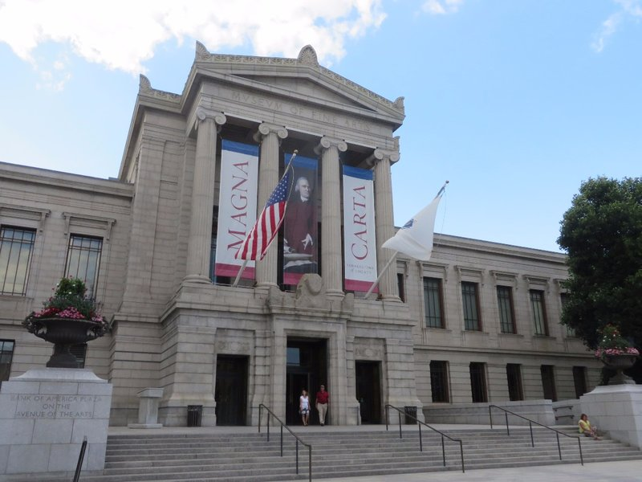
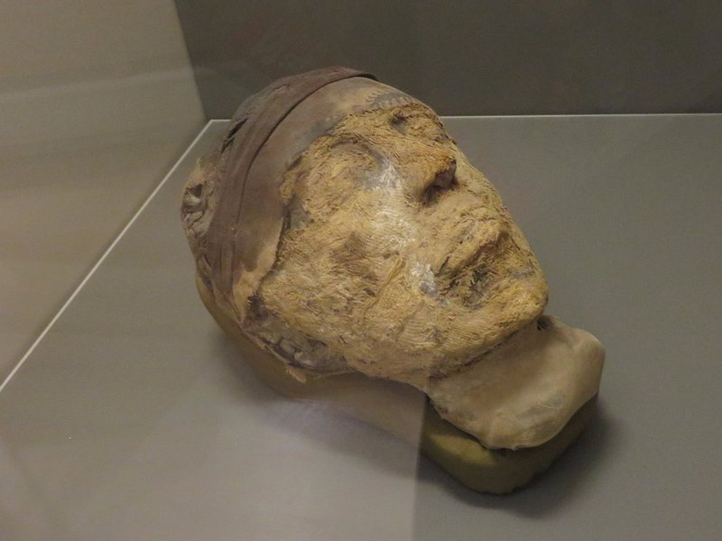
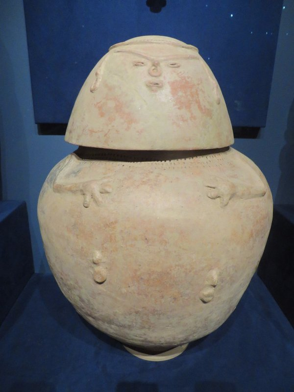
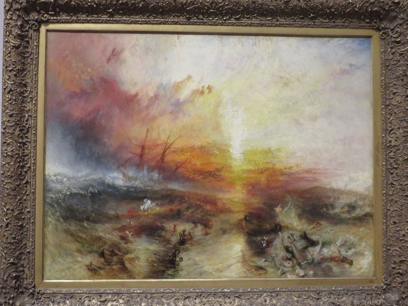
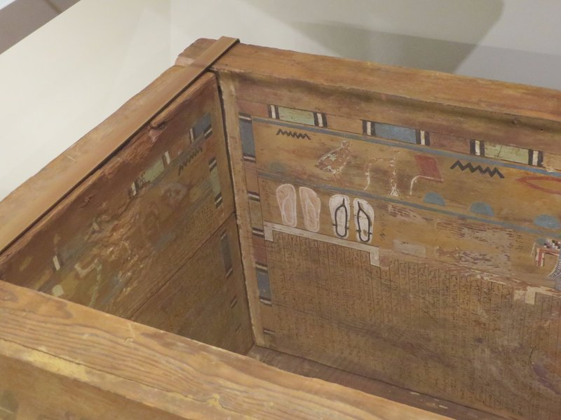
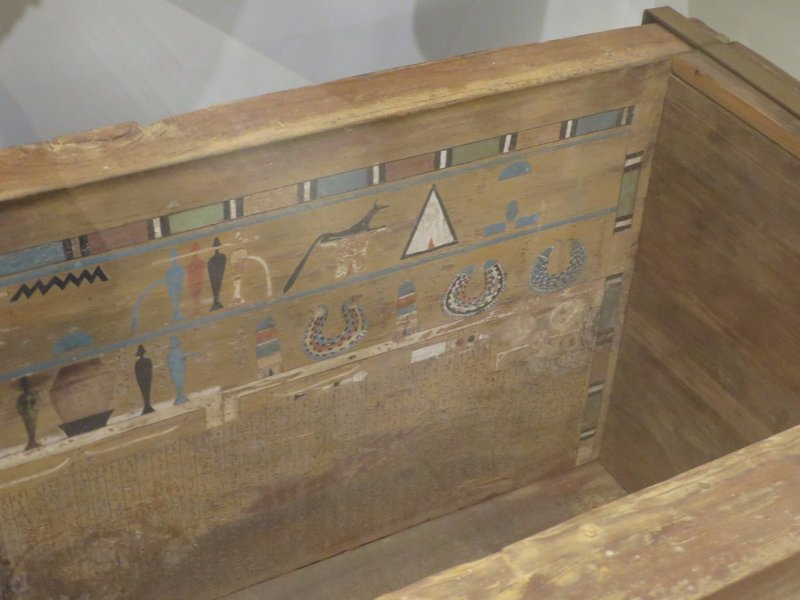

Unexciting day of transit. Up early, packed (as we failed yesterday), breakie, grabbed a taxi with a huge boot to the station with all of us plus luggage fitting comfortably. The station was more poorly organised than Washington. No platform was announced until 2 minutes prior to departure so all passengers for all long distance trains were crammed in the hall area with the gates/waiting areas completely empty. When the platform was announced there was pandemonium with everyone squeezing to get in as fast as possible as there was no assigned seating (again). Moronic. If Germany can announce platforms months in advance, the US can manage an hour. Luckily Kate is in her element holding her place in queue and death glaring old ladies trying to elbow past and we all get seats together.

The train was uneventful and about 4 hours later we arrived in Boston. We walked to the apartment and found the rooms weren't ready yet. We had a late lunch, checked in, and while Kate and Pat had a nap Jill and Peter explored town a bit. We managed to rouse ourselves long enough for a really yummy Japanese dinner, but that was the end of the day for us.

Our first full day in Boston we had a very exciting moment on our morning jog. On the loop back home we passed a big expensive looking van pulling into a parking lot. Kate paid attention hoping someone famous would step out. Instead a dodgy looking guy with dreads gets out, followed by another large guy in a suit. Kate decides they might be a drug cartel and avoids eye contact. At least until Pat elbows her because the third person to step out is none other than Mark Wahlburg/Marky Mark! Being disgusting sweaty monsters we don't stop to say hi, but it was cool nonetheless.

We decided to stick with the museum track today and go to the Boston Museum of Fine Arts, a gift from Simone and Jeff. On the way we stopped for lunch at a cafe where Dad relived Mum's experience from the Washington train station and was totally unable to communicate with the waitress with his accent. After multiple attempts to order 2 sandwiches, he left a confused clerk behind him and with only one sandwich in hand.

The museum had a special exhibition showing the Magna Carta, an agreement written in England in the 1200s between the ever unpopular King John (the lion in Robin Hood of course) and some of his more unruly barons. It has been scrapped and reinstated a number of times, but forms the basis for the US, UK and Australian constitutions. Pretty amazing to see in real life.

*Very Impressive Building!*

One of the more unique exhibits were near complete reconstructions of the framework from colonial houses from Massachusetts in the 1600 and 1700s. Apparently carpenters back then had their pick of the litter when it came to timber (before we cut it all down, I guess?). The frames were all made with these impossibly long pieces of wood that would be every carpenter's dream today. They also furnished some of the displays with period furniture, which despite being simply constructed for the most part, were all quite pretty.

There was another fun Modern Art section, some by Chuck Close (which Pat liked) and excellent, easy to understand explanations next to every piece. We also spent quite a lot of time on the Egyptian exhibit which was amazingly comprehensive with so much information. The museum led an expedition to excavate a tomb in the early 1900s. While the tomb had been raided earlier and lot of things were lost, there were so many interesting items. There were hundreds of these little wooden models of boats, farm animals, farmers and slaves which will apparently come to life for him in the afterlife? Plenty of steaks for Mr Djehutynakht after death. I guess you don't have to worry about red meat when you're already dead. And I guess it's better than their earlier practice of just burying the slaves and animals alive in the tomb. Baby steps!

*Djehutynakht's Head. Creepy.*

We popped home to for a shower (it's humid here), and read in the news that Robin Williams had died. We were all quite sad to hear that; with all the 90s kids movies Kate and Pat grew up with (Hook, Mrs Doubtfire, Jumanji, Aladdin, Fern Gully, Flubber, etc) he always felt like a weird uncle who stops in every now and then.

Once we were all dressed we walked to Little Italy. There were a whole load of different restaurants to try, many were packed. We headed off the main strip onto a side street and ended up with a great dinner from Pellino’s Ristorante.

On the walk home we passed a duelling piano bar, and thought we'd try to treat Jill and Peter to the same great experience we had in Texas. It was definitely nowhere near as busy as the place we went in Austin. The musicians were very talented, but not so charismatic. They did play Moondance for Jill though, so she was pretty chuffed.

*Fat American Indian Urn*

*Another Turner Painting- We'll Buy One When We Have A Spare $35 mil*

*A picture of some sandals that will become 3D and Mrs Djehutynakht will get to wear in the afterlife*

*And some necklaces incase she's going out somewhere*
