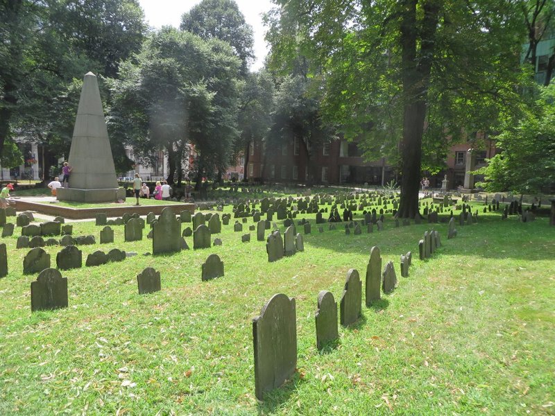
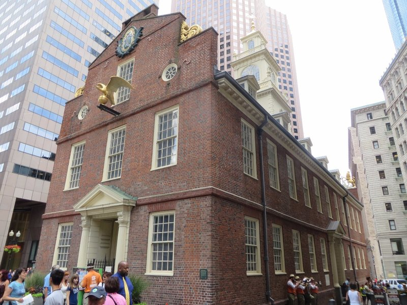
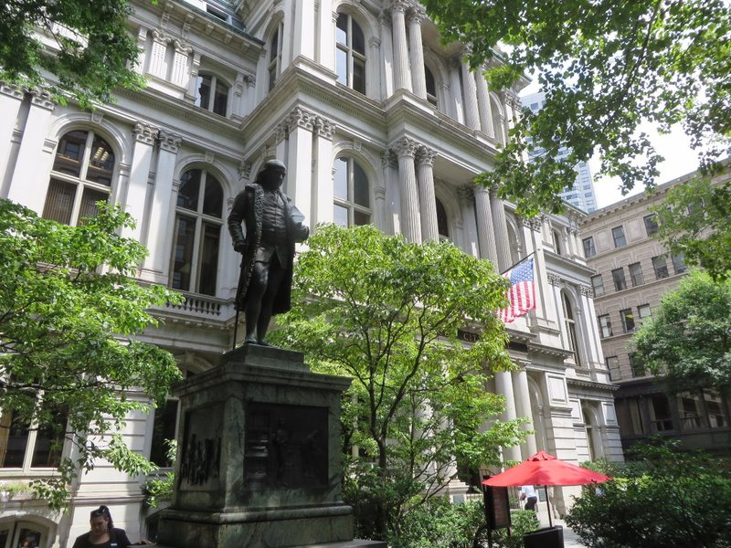
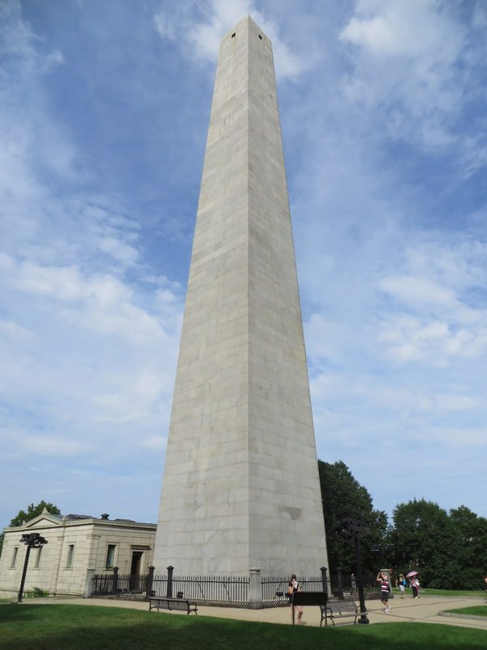
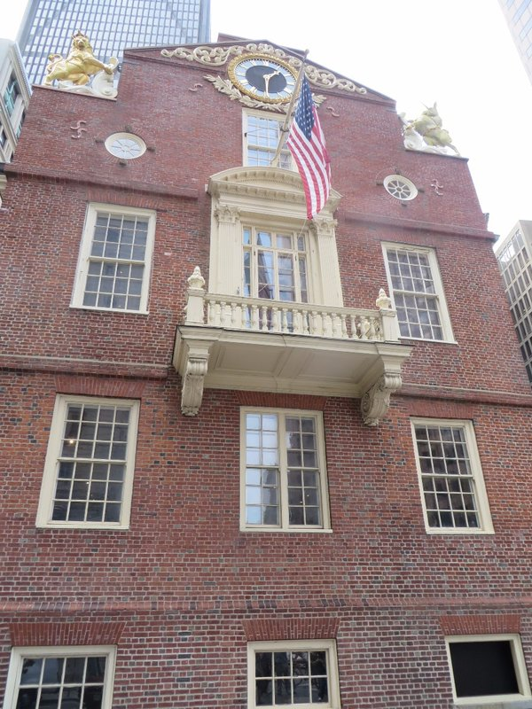
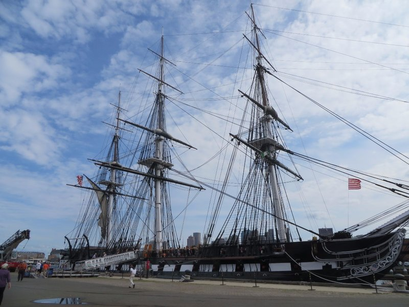
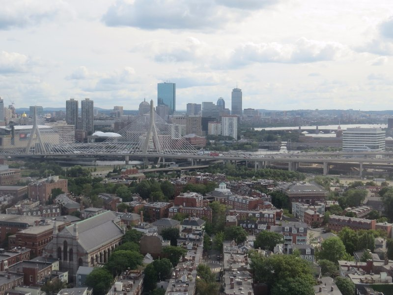
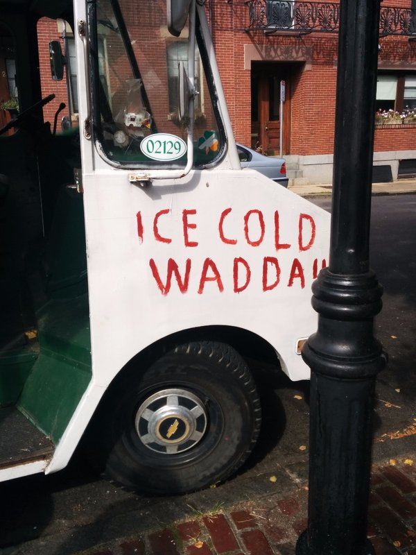

With our move to Vancouver coming up quickly we still have a number of logistics to sort out, one of which is health insurance (yay!). Pat spends what seems like an eternity online first trying to figure out what the hell Canadians call their version of private health insurance for visitors, then tracking down companies that actually sell it, and finally filling in endlessly repetitive forms for quotes. Not the most exciting morning.

That behind us, we set out for our day's activity: walking the Freedom Trail - a 2.5 mile trail winding through Boston stopping at a number of historic sites and buildings along the way. We trundled off to Boston Common, a large public park established in the 1600s (making it the country's oldest public park), our starting point for the Trail. Armed with a map, our phone with a list of sites and additional descriptions in case our brochure fell short, and a red brick trail to follow we set off.

*That Pyramid In The Background Is Ben Franklin's 'Modest Memorial' To His Parents.*

The trail took us past lots of historic buildings and several cemeteries where famous American patriots or their families were buried. The cemeteries had some of the most information out of any of the stops, often having a dozen or so information boards explaining the significance of the ground and its history. Many of the other buildings were now museums and had the requisite entry fee. Eager to have a cheapish day we skipped many of the paid attractions and took in what we could from the outside.

More than anything else we got a sense of how tense the situation was prior to the revolution breaking out. The British troops weren't at all shy about throwing their weight around to make the Colonists feel the intended pain for their refusal to pay the taxes which the Crown felt they owed for defending them against the French. Equally to blame, many of the Colonists were antagonising the troops every chance they could get, hurling insults and snow balls at the soldiers trying to push them to the breaking point. Unfortunately, things eventually came to a head in March 1770 when an English soldier struck a Colonist in the face with the butt of his rifle because the man had insulted his commanding officer. The situation escalated and resulted in the deaths of five Colonists by the time it was over.

*Old State House, Site of the Massacre- Excellent Band Playing On The Side. When We Arrived They Were Playing 'Never Had A Friend Like Me' (Robin Williams' Solo From Aladdin)*

What the British referred to as the "Unhappy Distrubance at Boston," Paul Revere labelled a "Bloody Massacre". The soldiers were tried for murder and were unexpectedly defended by the revolutionary John Adams (who was definitely *not* on the side of the British, but was on the side of fair trials and justice). Six of the eight soldiers who were tried were acquitted and the remaining two were convicted of manslaughter. More important than the outcome of the trial was the impact the massacre had on the public opinion towards the Monarchy (not positive).

Another stop on our tour was Paul Revere's house and the church where he famously had two lanterns hung to warn of British troops moving to attack the revolutionary colonists by water and then rode on towards Lexington announcing to everyone within earshot that "the British are coming!". Turns out there were two other men who rode similar missions that night (William Dawes and Samuel Prescott), but they were left out of the famous poem recounting the tale because their names weren't as easy to rhyme and as such slipped into oblivion. Also it turns out that he wouldn't have shouted the "British" were coming because most of the people he would be shouting to would consider themselves British. Go figure. Instead he would have referred to the troops as the Regulars, the Red Coats, or the King's Men.

*Statue of Ol' Ben Franklin In Front Of City Hall*

After spending a great deal of time walking around the old battle ship the USS Constitution, better known as Old Iron Sides (which I was disappointed to learn was not made of iron), we made our way to the Bunker Hill Monument - a monument commemorating the site of the first battle of the Revolutionary War. The monument, a giant granite obelisk, has stairs that you can climb to the top - 294 of them, give or take a step or two. We climbed our way to the top, admittedly huffing and puffing a bit (need to jog more!) and spent a very awkward few minutes at the top with about two dozen other strangers in a very small and confined space. We eventually made our way back down and grabbed a taxi home.

*All Four Of Us Conquered This!*

While in the taxi, we read in the news that apparently some people in Cambodia have finally been convicted for crimes they committed during the time of the Khmer Rouge. Really great to hear- late justice is better than no justice at all.

Dinner consisted of a delicious hot buffet from the local supermarket (we're really growing to like these supermarket meals!) and once we had scoffed down more food than any of us intended, we made our way to bed.

*The Balcony The Declaration of Independence Was First Read From*

*Ol' Iron Sides, No Iron In Sight*

*City View Boston*

*Nice and Refreshing!*
