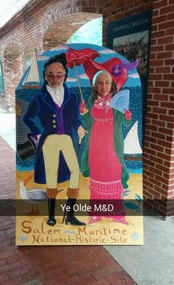
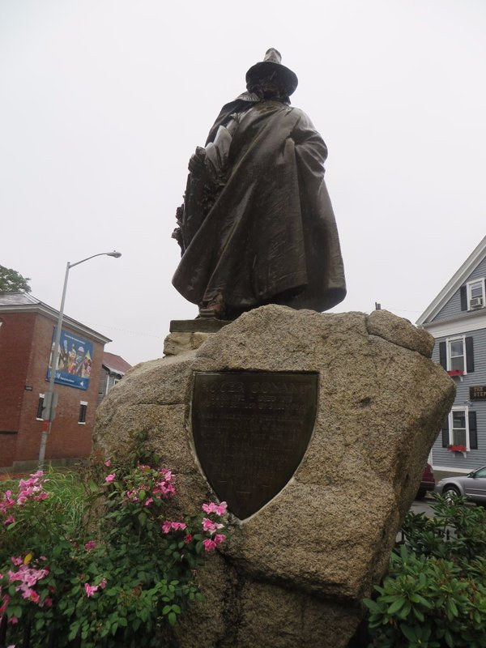
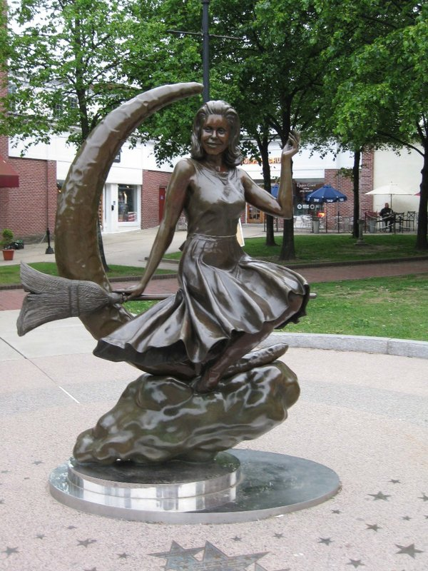
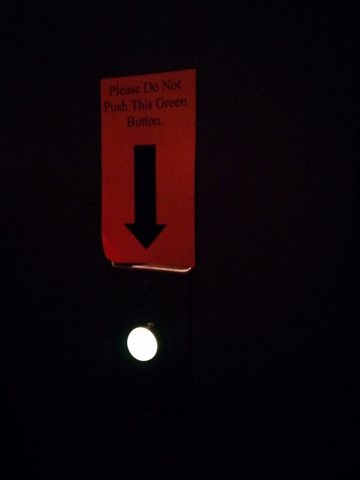

Woke up to a very gloomy and rainy Boston, so we decided to give the jog a miss this morning. Instead, we'll head over to the ferry terminal a bit early and make our way out to Salem for a day of learning about witches!

*Getting In The Salem Spirit*

The walk through the city was rather frustrating. Something about the way the buildings are all positioned creates these little mini wind vortexes that make it near impossible to wield an umbrella without it flapping about wildly and turning inside out every five seconds. Pat eschewed an umbrella and opted to just use the hood on his rain coat; Kate, on the other hand, was fighting an uphill battle with her umbrella the entire walk. Frustrating times. We finally made it to the ferry terminal and happily walked up to the ticket booth thinking that at the very least we would be on the boat soon and out of the rain. That is we would have been on the boat soon, had it not been cancelled due to rough seas. Strike two for the day.

Undeterred, we continued on our way to the train station as the girl at the ferry ticket counter told us that we could take a train instead if we still wanted to get to Salem. More wandering in the rain, more battling with the wind to keep umbrellas under control. We eventually came to the train station to once again find out that they do not announce which track a train is departing from until only a few minutes before departure. Presumably this is to keep people off the platforms, but all it creates is a momentary panic as people hear their train is boarding and make a mad rush from the waiting room through the one set of doors leading to the platforms. At least we weren't there during rush hour!

The rain followed us all the way to Salem and we walked from the station to the Visitors Centre hoping to find a laundry list of fun, dry things we could do with the rest of our morning and afternoon. They were showing a movie that introduced visitors to the town and the region and gave a brief back story to the town's unlikely rise to infamy. Amongst other things, we learned that during the industrial revolution the town was home to some large textile mills which claimed the lives of 1/3 of their workers before they could reach their 10th work anniversary. Not very uplifting stories.

*This Person Is Better Equipped For The Rain Than Us*

Of course we also learned about the witch hunts that happened in 1692 and the subsequent trials which saw 20 innocent people executed for their supposed "crimes". In an era of superstition, religious extremism, and relative isolation from the outside world, several young girls in Salem Village accused a handful of people of bewitching them and blamed them for the strange behaviour they were exhibiting. At the subsequent trial, a wonderful thing called 'spectral evidence' was used against the accused that would see many of them convicted and sentenced to death by hanging.  I'm going to copy some information from Wikipedia here because my words won't do this justice (emphasis mine).

Spectral evidence was "...the testimony of the afflicted who claimed to see the apparition or the shape of the person who was allegedly afflicting them. The theological dispute that ensued about the use of this evidence centred on whether a person had to give permission to the Devil for his/her shape to be used to afflict. Opponents claimed that the Devil was able to use anyone's shape to afflict people, **but the Court contended that the Devil could not use a person's shape without that person's permission**; therefore, when the afflicted claimed to see the apparition of a specific person, that was **accepted as evidence that the accused had been complicit with the Devil.**"

Yes ladies and gentlemen, you read that right: the COURT (which presumably included educated lawyers) concluded that the DEVIL couldn't use a person's shape without their permission. Essentially, someone has a scary dream where they saw you as the boogie man, therefore you're in league with the devil and must be hung. Pretty solid logic.

*Too Rainy For Me To Snap A Pic Of This Statue- Stolen From Google*

After our cinematic experience, we ventured out (in the rain, of course) and found a soup place for lunch where we enjoyed some deliciously warm chow-dah. Re-energised, we went back to town and made our way to the Salem Witch Museum where we thought we might learn a bit more about the trials and their historical impact. Unfortunately we missed a bit with this one. We were first treated to a moderately amusing recorded show which took you through the timeline of the first accusations to the trials and hanging and explained how and why everything happened the way it did. The most entertaining part of this was watching several small children being lead out of the room by their overprotective parents because the paper mache devil was too scary. The kids didn't even seem to be paying attention and weren't quite sure why they had to leave. However, one kid took things into his own hands by saying "Nope, I don't like it. I want to leave." and then making a constant whining sound as he made his way to the door.

We were then ushered into the 'museum' portion of the building which included a rushed 10 minute overview presented by a clearly disinterested employee and were then left to our own devices. Unfortunately, there wasn't much information to be had. We looked at the timeline of random events in the last 2000 years (no explanation of why these were chosen- Victoria was the longest reigning queen of England- obviously important in relation to persecution of 'witches'...), the display of dried herbs, the pictures of Samantha from Bewitched and the cast from the Wizard of Oz, and then decided it was time to make tracks. We checked the train timetable they had helpfully laid out at the museum, stopped off briefly for a hot chocolate at a cafe, and made our way to the station. In the rain.

*Could They Possibly Make This More Appealing?? We Resisted, Then Got In Trouble Anyway For Taking A Photo*

As it turns out, the timetable was out of date and the train wasn't coming for another hour. Not willing to walk back into town, we sat at the station and passed the time there. We did manage to see a man walking his small dog near the station holding an umbrella, but instead of holding it over his head, he was holding it low and over the dog's head. Such a spoiled dog. We would never do that for Xena... (...*shifty eyes*)

Eventually the train arrived and we went home via the supermarket to grab some dinner. It's a good thing we're moving to Vancouver because we really don't like the rain!
