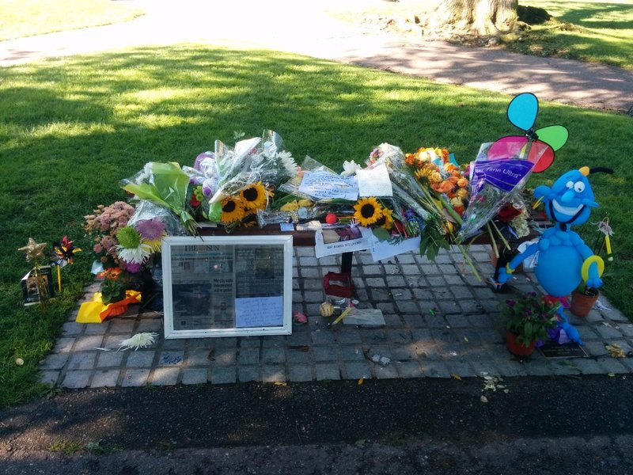
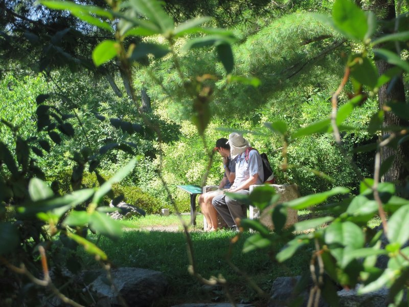
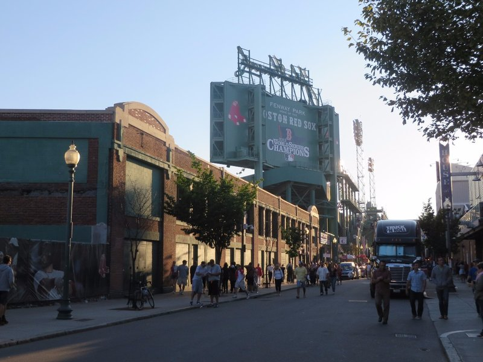
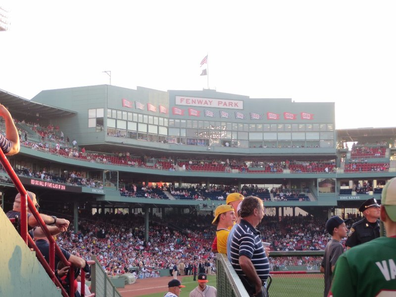
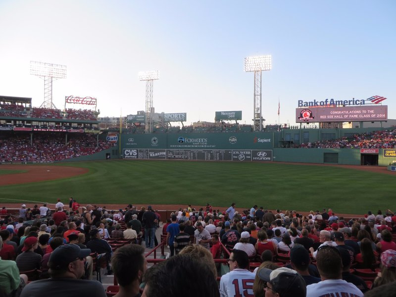
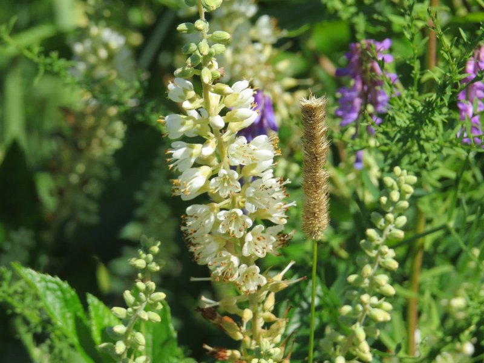
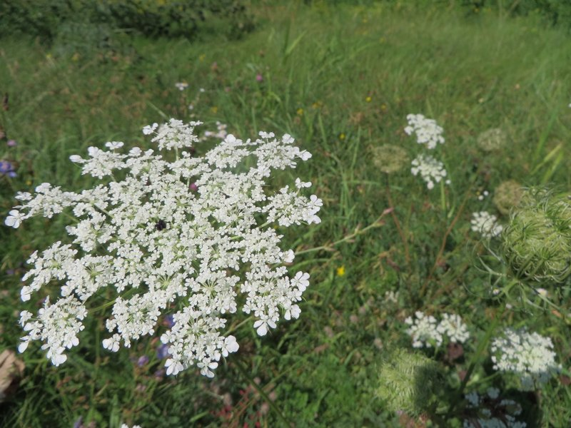
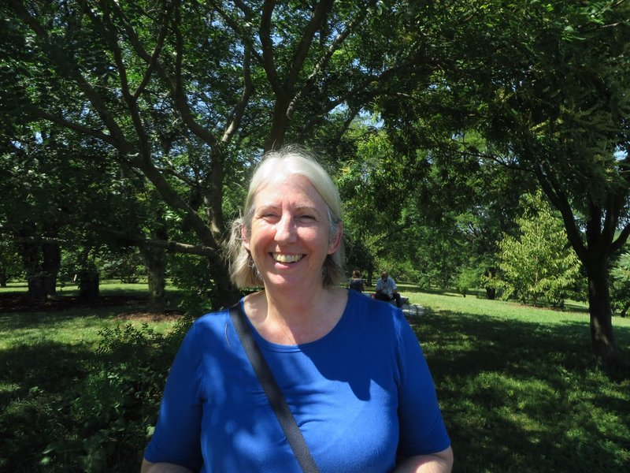
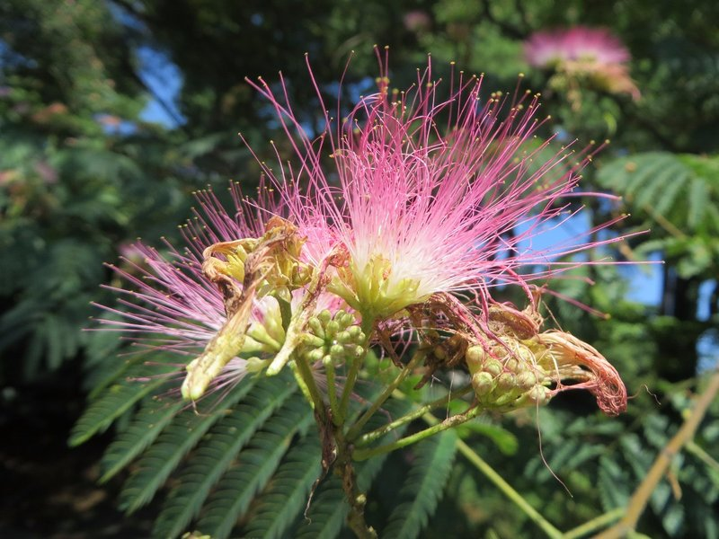

No rain this morning so no excuse to avoid jogging. We headed to the Boston Public Gardens and did a few laps of the duck and goose filled pond. On the third lap we passed the bench Robin Williams and Matt Damon sat on in Good Will Hunting. It had been turned into a mini shrine with flowers, pinwheels, poems and photos. It was quite nice, but sad.

*Impromptu Robin Williams Memorial*

After de-stinking and eating we caught the train towards the Arnold Arboretum, a big park full of trees, associated with Harvard University. We spent a few hours walking past the huge old trees, the unblooming roses, ponds, bonsais (some planted in the 1730s, before the US was the US!) and up and down a few hills. We got terribly jealous of the cute dogs other people got to walk around the park. Oh Xena! How we miss you!

*Spying On Dad and Pat*

By this time we were fairly peckish. After a struggle working out the map and the Internet and life broadly we set out in search of food. Seemingly we failed, finding only industrial buildings and a bus station. Then, finally, a pub appeared. And it was packed! Where did all these people come from? Apparently the Sam Adam's brewery up the street. Seems this pub is partnered with them and had about a million varieties of Sam Adams beers, ciders and shandies on tap! Pat was in heaven.

Following a big pub lunch we headed back to the subway- Kate and Jill to Macy's to find clothes for the par-tay on Saturday (we're having a kind of second wedding reception after the trip when we get to Pleasanton), Pat and Dad home to nap. Kate's jealous of Pat and Dad's afternoon activity, but despite my misgivings about Macy's, I ended up succeeding in finding a very nice dress. About 6pm we met at home and headed to the baseball game (thanks Jamie!), the Red Socks vs The Astros.

*Unassuming Exterior*

Built in 1912, Fenway Park is the oldest ballpark in Major League Baseball and arguably has the most character. Needless to say, Pat was pretty excited to have an opportunity to watch the Red Sox play at home! Walking through a modern ballpark, you're aware that everything was designed with efficiency in mind; food vendors are strategically placed, the seats are angled towards home plate so you don't have to strain your neck to watch the game, and you're given enough room in your seat to at least sit back against the back rest if one were so inclined.

At Fenway, it felt sort of like stepping back through time. The concourse was tucked underneath the seats and had an imposingly low ceiling and all of the signs were printed to make them seem as if they were from the 1920s. The seats were impossibly narrow which meant that either you or the person next to you had enough shoulder room to sit back, not both, and the seats were helpfully pointed straight ahead. This meant if you were sitting on the right field foul line like we were, you were pointed towards center field (with an admittedly awesome view of The Wall). If you wanted to watch the game, you had to swivel in your seat and look left the whole game. All of this just added to the atmosphere in my opinion. I wouldn't want to be a season ticket holder, but watching a game in a ballpark this old has a certain feeling to it that you just don't get from a newer park.

*Oldest Ballpark in Major League Baseball*

Before the game, they had a ceremony where they inducted past players into the Red Sox Hall of Fame including Nomar Garcioparra (NOMAARRRR!), pitchers Pedro Martinez and Roger Clemens, and longtime radio announcer Joe Castiglione. Not a bad pre-game ceremony to be a part of! With the game underway, Pat made his way to the concourse and picked up a couple mandatory hot dogs to make the game official. Kate went a non-traditional route and picked up some tacos, but they looked pretty tasty so Pat gave them his seal of approval.

Despite the 9-4 Boston victory, both the Red Sox and the Astros were having an off season, so the game lacked any real fireworks. The highlight of the evening for both of us was in the middle of the 8th inning when they started playing Sweet Caroline on the public announce system. Completely unaware of this tradition, Kate was surprised when the entire stadium started singing along during the chorus. Not a bad send off for our last official evening on this trip before we head back to Pleasanton tomorrow. Then on to Canada!

*View of The Wall From Our Seats (Pat Says That Green Wall Is A Tourist Attraction... Go Figure)*

*Boson Arboretum Botanics*

*Crawling White Plant*

*Jill Loving The Sunlight*

*Pretty Pink Puffs*
