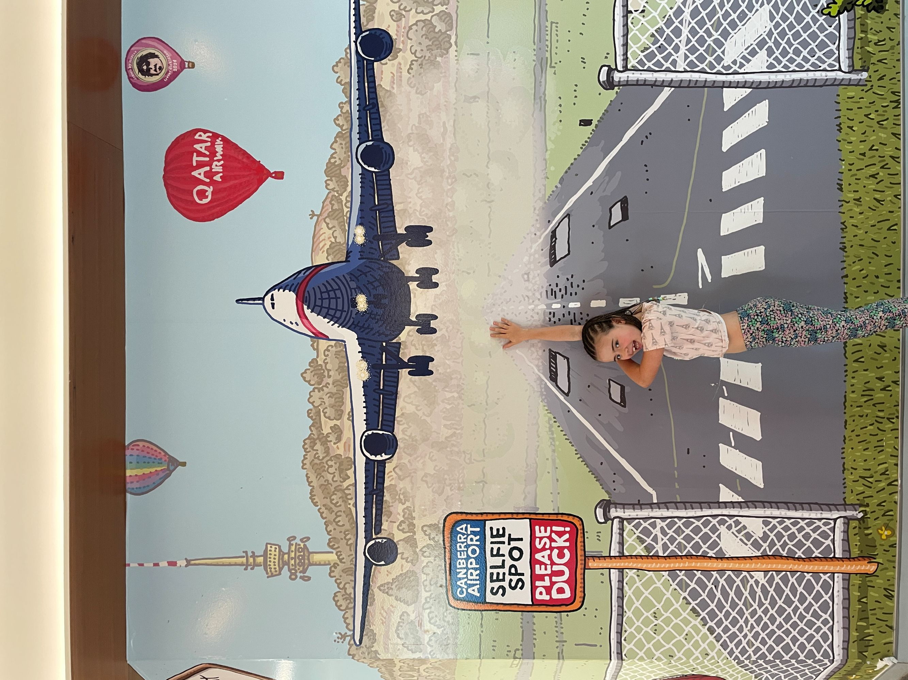
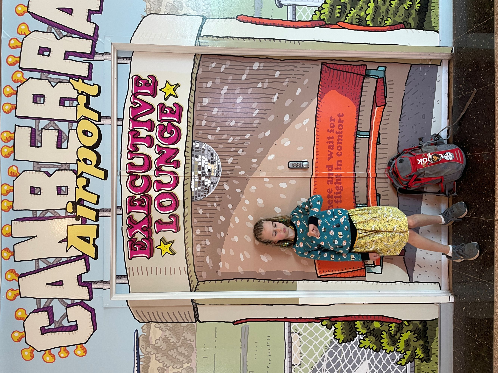
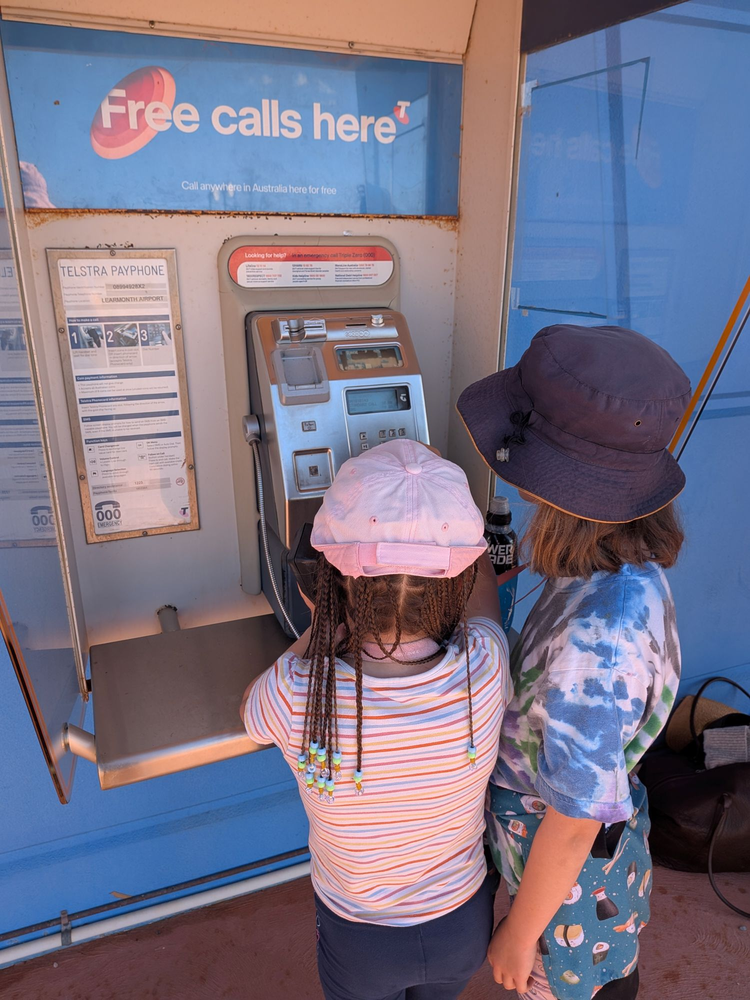
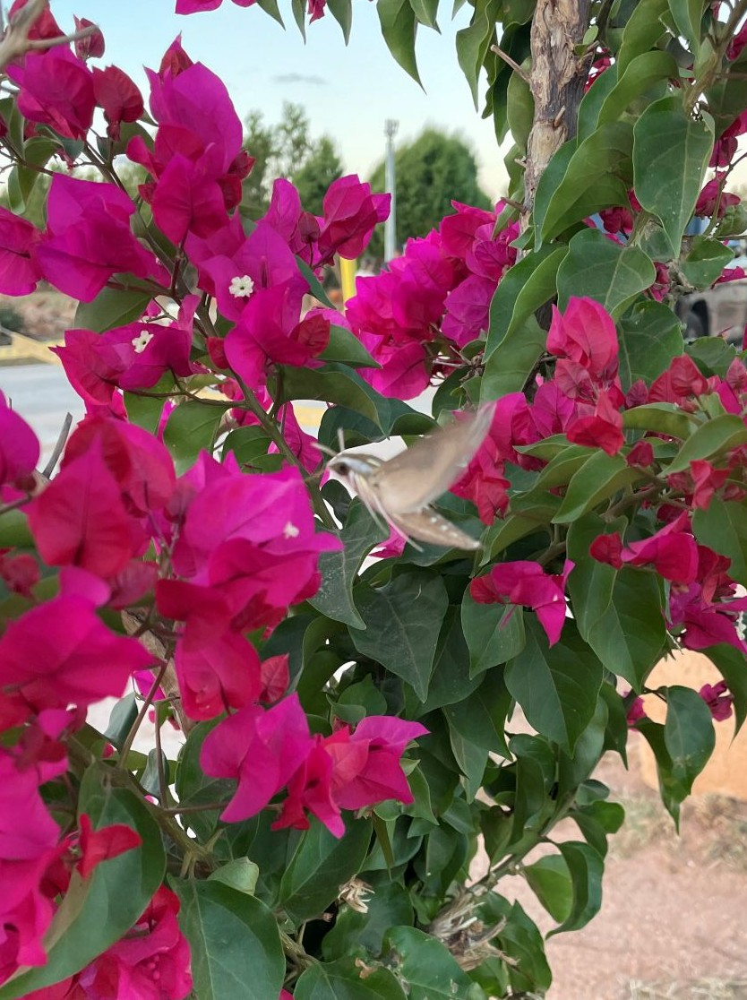
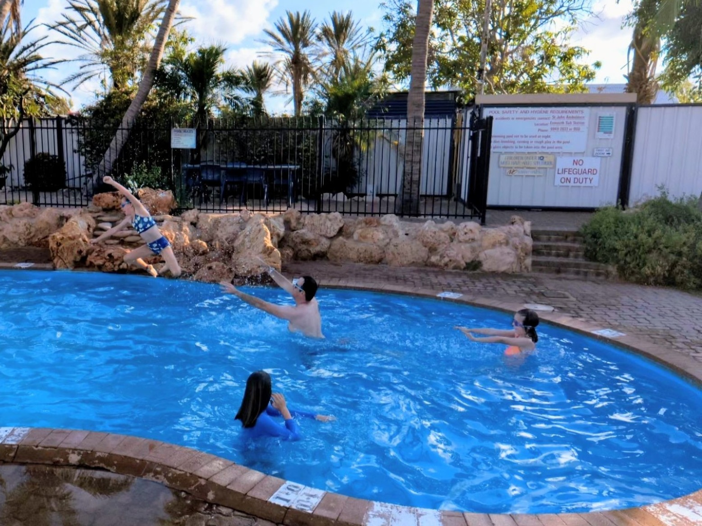

Almost six days had passed since landing from our whirlwind trip to Toronto (via Vancouver via Nadi) for Taylor's wedding. So we figured we might as well keep the jetlag going, and commenced another convoluted transit to a time zone as far from Toronto as you can go without getting closer again. 

The biggest motivator for this trip was swimming with the whale sharks, ostensibly for Pat's 40th, but largely driven by jealously after Bini and Todd's similar trip last year. 

The journey to Ningaloo, Western Australia involved two flights to get to Perth, and an overnight stay, and another flight to Learmonth. Getting over to Perth, we shared a few confusing conversations with fight attendants who saw the girls' braids as a great conversation starter, but couldn't understand why a family returning to Canberra from Fiji were on a flight to Perth. "Because of the whale sharks!" didn't seem to clear it up. 

*Somehow still excited about airports*

Landed late, a night in a Perth motel, back on a plane and we finally landed at the tiny Learmonth airport. 

We gather the recent cyclone has caused a bit of damage to the airport building. Rather than exiting through the terminal, we’re guided from the runway, around the side of the building, and out an emergency exit in the gate. 

*Kids had never seen a public phone before and were amazed they could use it to call Nana*

On the other side, there are a few gazebos set up with tables and chairs under them. No signage, no indication of why. After standing around awkwardly for a couple minutes, Pat asks someone where the rental car offices are. The man indicates to the tables and chairs under the gazebos. Ah. 

The “Avis” table was empty. Turns out they were operating from a trailer in the car park using a small portable generator to power their laptops and a printer. Kudos to them for getting shit done in spite of the airport buildings being out of commission!

Safely installed in the car, we drove past the red dirt, huge termite mounds, satellite dishes and the Harold Holt Communication Station Towers (which I am now learning, like Holt himself, are the centre of a plethora of conspiracy theories from weather control to mind control to shielding alien technology to serving as the Australian centre for devil worship) to make our way to our accommodation, Yardie Homestead. 

*An amazing hawk moth we watched out front of our cabin*

Now we had a rego number from the rental car, we went online to get our digital parks pass. We soon found our idea of ‘digital’ and theirs do not match. The ‘digital pass’ needs to be physically printed and left in the windscreen of the car. Surprisingly we have no printer, nor does the remote, cyclone damaged accommodation we’re staying in*. Problem for tomorrow. 

*Last activity for the day - a swim*

*I'm looking back through some of our previous adventures, and was reminded of a train from Paris to Fussen we almost missed in 2014 because we failed to print our digital tickets. Glad to see we are learning from past experiences and looking forward to making the same mistake in 2037.