Today is whale shark day! We went with a company Dot and Tim recommend, Live Ningaloo. Our bus collected us at 8.15 from Yardie, which was the last pick up spot before heading to the boat jetty. The first part of our journey involved taking a small  tender out to our larger boat for the day: Wave Rider. Pat’s proclivity for getting sea sick wasn’t thrilled by the aggressive name of the boat, but we’d all loaded up on sea sickness medication so hopefully that would keep illness at bay. 

They took the four of us to the boat first so the kids could have a bit more space to get themselves geared up before the rest of the group arrived. A nice touch. The boat was definitely set up more for leisure than for diving. It had a reasonably sized back deck with padded seats for everyone, a kitchen and drinks area inside, a loo, and two bunk rooms, which despite having beds in them were only being used for storage. On arrival, we were offered a choice of drinks (the kids jumped at the chance to have lemon lime & bitters) and biscuits.

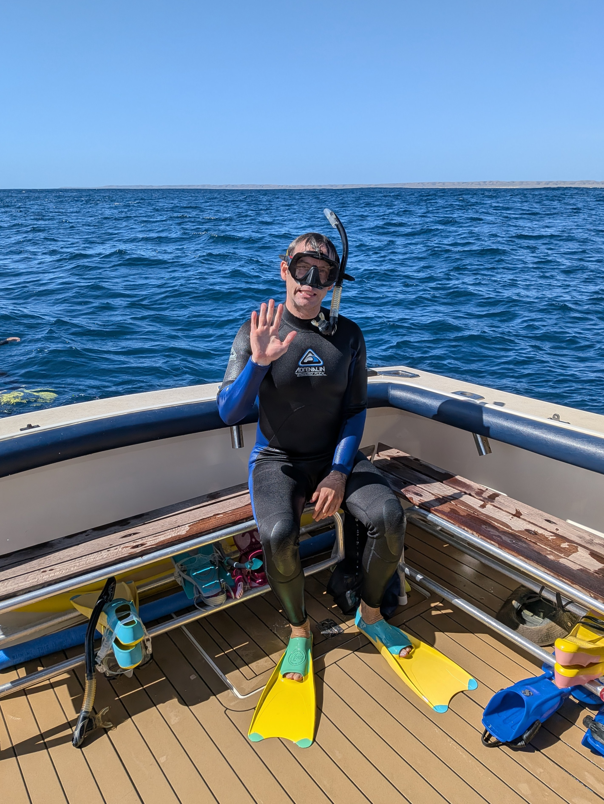

*Lookin' snazzy*

We had 4 people as our crew for the day: the skipper Nick, photographer Ross, dive master and marine biologist Gemma, and deckhand Dan. Gemma and Ross would be in the water with us for each dive while Nick would be on the radio communicating with the spotter planes that were circling the reef looking for megafauna.

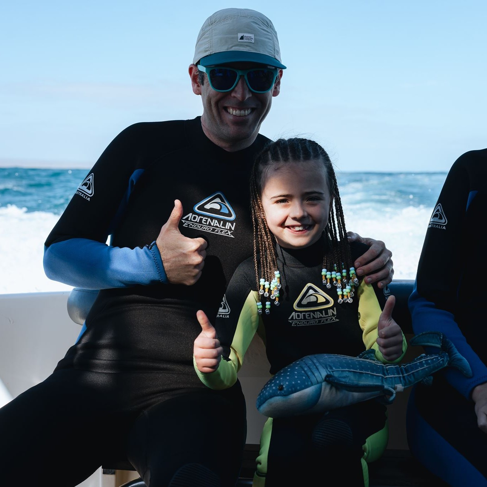
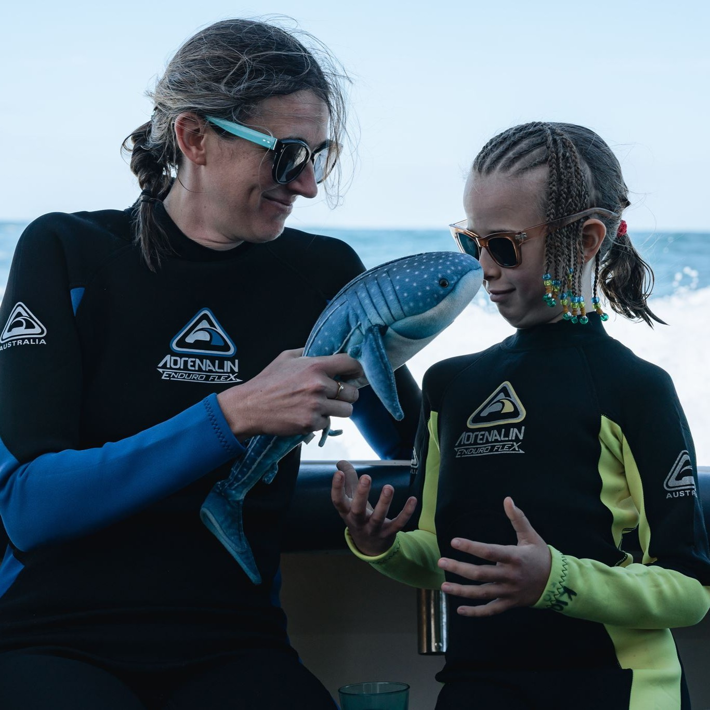

*Serious business learning about whale sharks*

First dive of the day was a “gear check” snorkel at a lagoon on the reef. The kids were a little hesitant to jump off the back of the boat, but with a bit of gentle and empathetic encouragement from their parents (“Get in already, you’re blocking everyone else!”) they hopped in the water. Gemma was excellent with the kids, she gave them enough space to float around and do some duck dives but she was never far off with the rescue banana (not sure the technical term for this flotation device, but it’s yellow and looks like a banana, so “rescue banana” feels appropriate). I don’t remember spotting anything remarkable during this first dive; most of the focus was on making sure the kids were adjusting to the water and had remembered how to not die while using a mask and snorkel. So far so good for them. Kate however totally freaked out and had to go on the rescue float; it feels very wrong to stick your face in the water and breathe in (Aside from Pat: But apparently it’s natural to stick your face near snakes?) Gemma gave Kate a pool noodle for moral support. Back on the boat, we made our way through the reef and out to the open ocean.

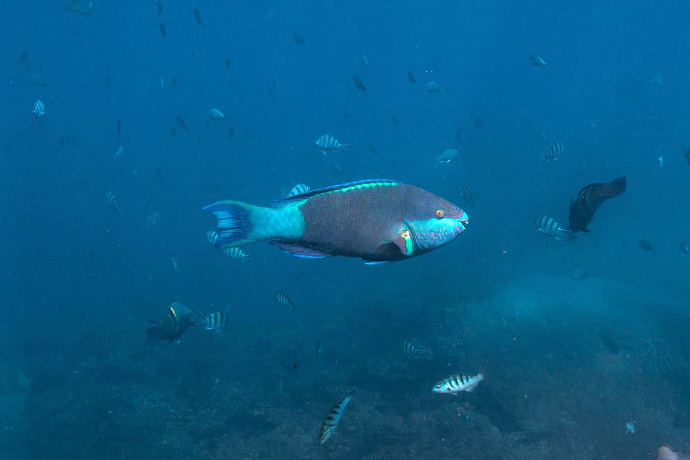

*Oh heeey*

While we were moving, our plane had apparently spotted three whalesharks, but by the time we got there 2 had dived and 3 other ships were circling. It makes sense in retrospect, but at the time we didn't realise multiple boats would be at each shark. The WA government strictly (and pleasingly) limits the number of tour operators in the area as well as how long the boat’s passengers are allowed to be in the water with the whale sharks (1 hour per day per boat). Knowing that, we’re even more glad that we splurged and went with the company we did. Our boat has a maximum of 10 passengers, all of whom can be in the water at the same time. Other companies have a max of 20 passengers and split them into two groups of 10 swimmers. So if you’re able to follow the complex sea math, we’re able to get twice as much time in the water.

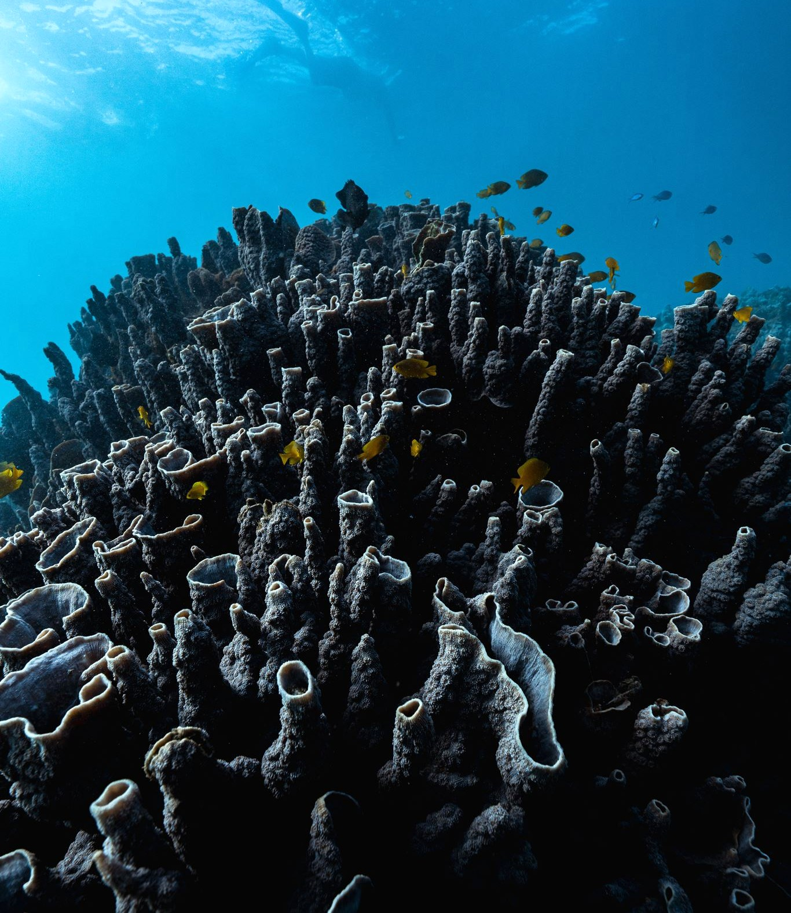

*Intricate coral formations*

Our time at the first whale shark, who the kids named Popcorn, was relatively brief. The “plan” was for everyone to hop in the water and wait for Ross to signal the orientation of the whale shark. They tend to swim in a straight line, so the normal procedure is to form a line in the animal’s direction of travel. Ross would then set up to capture a photo of each person in turn, giving them a “come here” signal, at which point they’d swim a bit forward of the line and pose for the photo. He’d then signal “OK!”, letting the person know they could swim away and observe the whale shark from the back or the other side while the next folk in line came forward for their photograph. All very logical and civilised.

The reality, however, was much different than the logical theory described on the boat. The first part went relatively accordingly to plan (everyone lining up in the expected direction of the whale shark’s travel), but then the overwhelming excitement of being in the water with such a large fish combined with a wild animal’s natural instinct to be, well, wild and unpredictable took over. Popcorn decided that she would rather not swim in a straight line. Straight lines are for suckers, and she was not a sucker. So she took a twisty turn-y route through the water leaving chaos in her wake. The group fractured and everyone swam their hardest to try and catch a good glimpse of Popcorn while maintaining the mandated 3 meter distance. Kate and Violet spent most of their time swimming backwards as she continued to approach - Gemma told us later she was attracted to the bubbles we were making. Just as Pat and Margot caught up with everyone else, another boat’s passengers all jumped in the water for their turn, so Ross had to call it for that dive sans family photo. We all swam back to the boat and hopped aboard, beaming with nervous energy and excitement (and a little frustrated about the lack of photo).

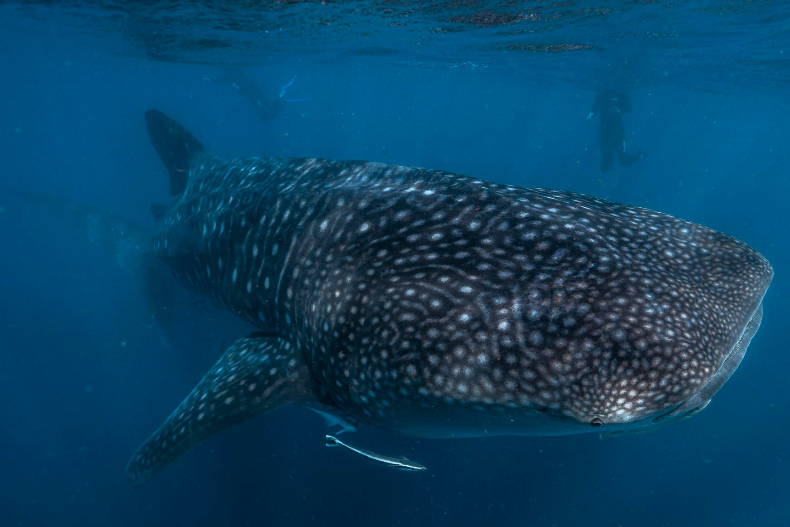

*Popcorn running rings around us*

Rather than just hang around waiting for the other groups to have their turn, Nick took us to a humpback whale which had been spotted nearby. Needing to keep a distance of at least 30m from the whale, we hung back and watched it breach and splash a few times before heading back for our next turn with Popcorn. This time Popcorn was more or less traveling in a straight line, but she was moving quick! It was hard for us all to keep up, so again no opportunity for a group photo. The visibility wasn’t fantastic either; this is a side effect of the highly plankton rich water, which is why the fish are here in the first place. Eventually, Popcorn decided she’d had enough of us and dove (according to Gemma they can dive at least 2,500m; we don’t know exactly how deep they can dive because the  trackers that are placed on them stop functioning at that point).

Soon enough our spotter plane had another whale shark for us to visit and we set off. By now, the kids were getting pretty chilly with the combination of being wet and the wind from the boat pottering along the water. Ross selflessly lent them a massive woolly jacket which enveloped them both and kept them from turning into popsicles. There was only one other boat at the second fish when we arrived. This one was named Clover according to Violet and Margot, and who are we to argue?

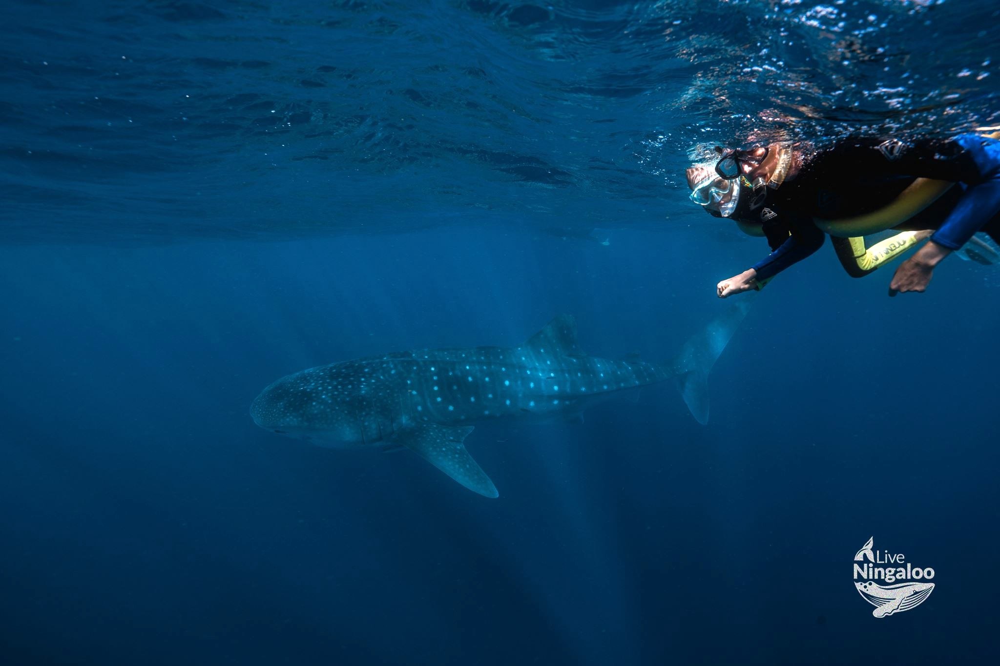

*Kate and Vi and Clover*

Like Popcorn, Clover was also in a hurry. Kate was feeling much more comfortable in the water now, but kept the pool noodle just in case one of the kids needed it. Kate and Vi, aided by a tow from Gemma, managed to swim quickly enough to get to the front of Clover for a photo op. Again Pat and Margot were a bit too slow to keep up with Clover’s fast pace, so no family photo. Back on the boat, the kids made the joint call that they were too cold to keep going in the water and they wanted to dry off and warm up. Fair enough! So Kate took the kids to get changed while Pat hung out on the back of the boat. 

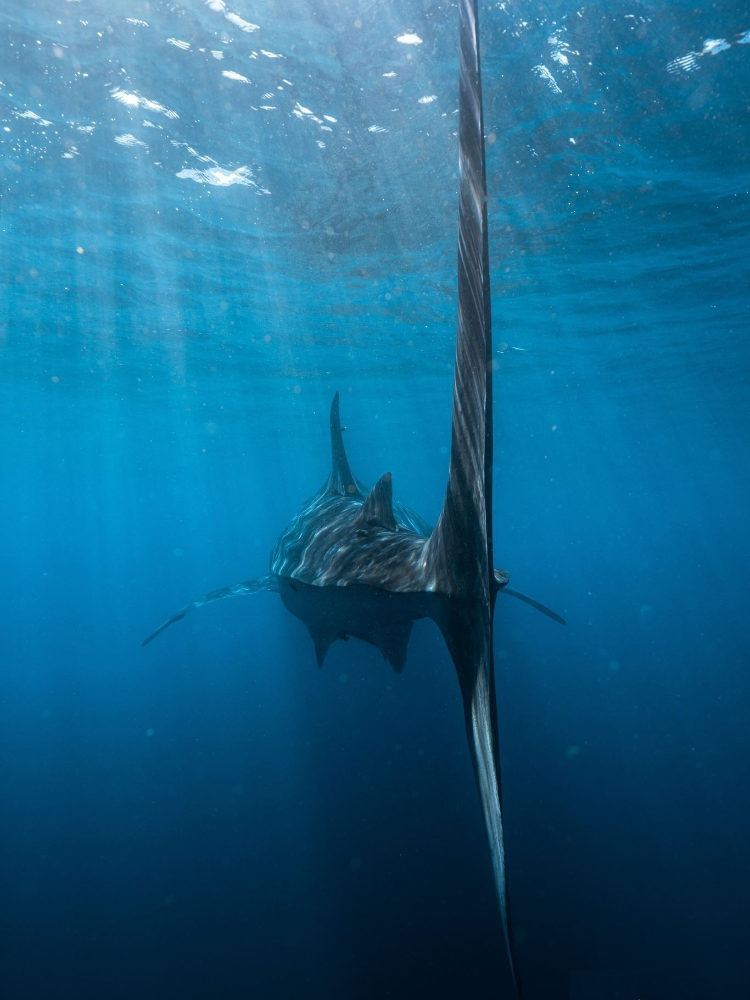

*Fat Bottomed Girls, you make the rocking world go 'round*

While Kate dressed the kids there was another opportunity to get in the water, so Pat went solo this time. For whatever reason, Clover was content to swim slowly and in a straight line, finally accepting that she had to follow the rules just like everyone else. This dive was so much less stressful with the whale shark moving so slowly (honestly, not stressing about the kids drowning helped too); Pat could swim along side, let himself fall back and swim in her wake for a bit, then speed up to watch from the other side of her, taking the time to soak in the experience. Back on the boat briefly before going in one more time for a last swim with Clover while she was still cooperating. Another calm, ambling swim. Ross was able to get a couple pictures of Pat alone with Clover before we had to hop back on the boat and make our way back to the other side of the reef. Margot decided that Ross must have the answers to all the world’s questions, so she did what every self-respecting kid does at least a million times in their life: asks him “why?” over and over and over again. To his credit, he kept answering for approximately 20 more “whys” than either of us would have put up with until they got back to the times of the Romans and he had to get back to work.

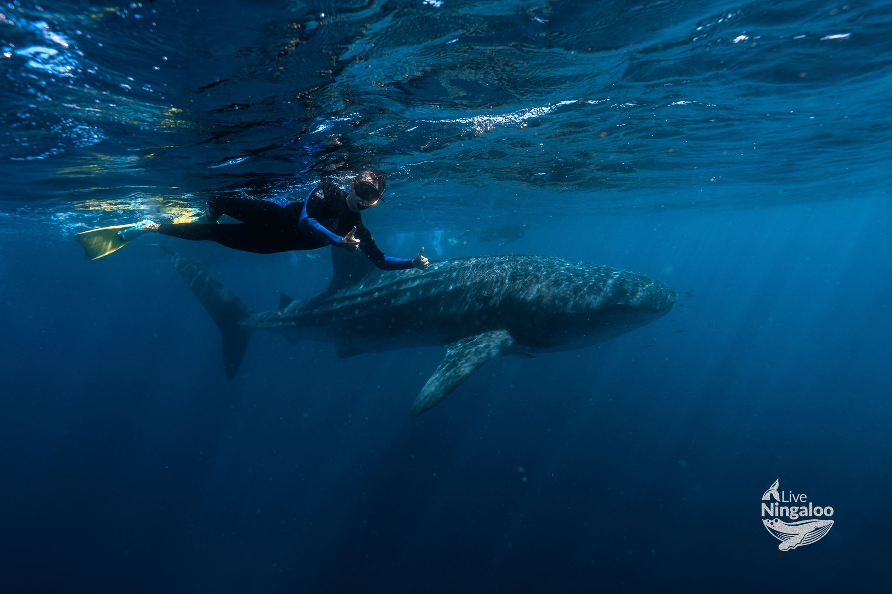

*Pat channeling his inner Fonz - "ayyyy!"*

Back at our mooring on the reef we stopped for our final snorkel of the day. Despite there being quite a strong current this swim was much more fun for Kate and the kids because there was no time limit and the swim wasn’t so structured. The coral below us was quite deep, maybe 5-7m (take that estimation with a massive grain of salt). Understandably, Kate wanted to get closer to the coral to get a better view. It occurred to her that this is probably what motivates people to learn to scuba. Perhaps getting comfy snorkelling prior to getting into scuba would have made the whole ‘learn to dive’ experience less stressful.

In the water, Margot tracked Ross down to ask for a photo of her diving. Ross countered with “why, why, why?” What goes around comes around. When we popped our heads up we saw the strong current had carried us all a long way from the boat. We tried our best to swim against the current back to the boat, but eventually Vi and Margot both needed to be “rescued” (Vi by a pool noodle which Kate was glad to have kept, Margot by Gemma with her rescue banana). Highlight of this dive: saw a turtle 🐢! 

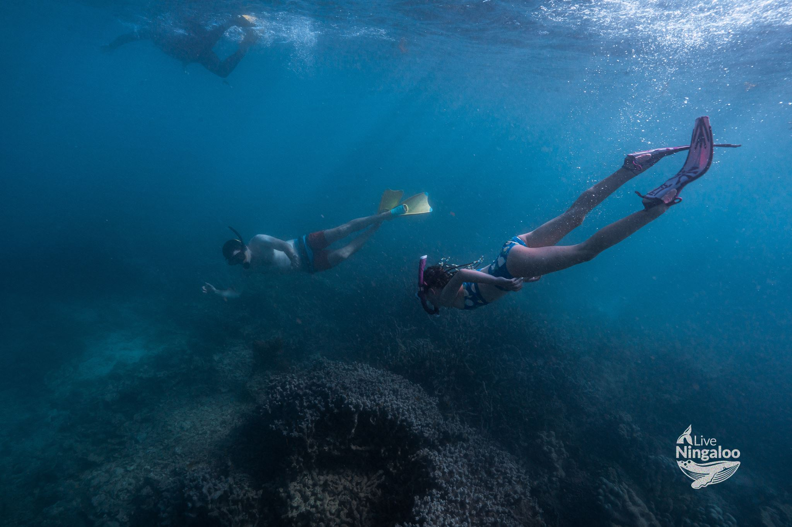

*Ross caved eventually*

All in all great day, but far from low stress. It’s a totally different experience when only 30% of you can be enjoying the moment because the rest is keeping eyes on kids and worrying they'll drown or drift off with the current. The staff were all excellent and really kept a close eye on them. Another guest, cancer doctor Terry, was also great showing the girls lots of pics from his GoPro and chatting with them to keep them entertained when Pat was doing his solo thing in the water. Despite the cold, the kids enjoyed themselves too. I don’t think either of them were stressed about drowning - that’s the privilege of being a kid! 

To close off the outing, Nick popped open a bottle of sparkling wine and poured everyone a glass to celebrate the end of a magnificent day. The kids had another glass of lemon lime bitters (in champagne flutes!) and some jelly snakes. Back on the tender to the jetty, bus back to Yardi, and flomp with exhaustion.

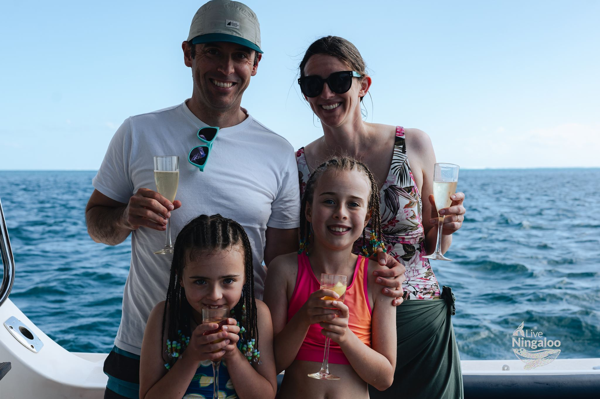

*Finally got that family photo*

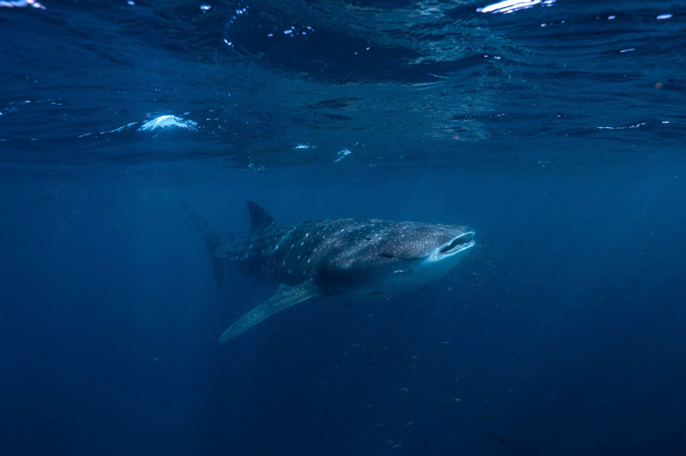

*No one could have criticized the Fonz' shark jump if Clover had been involved*
