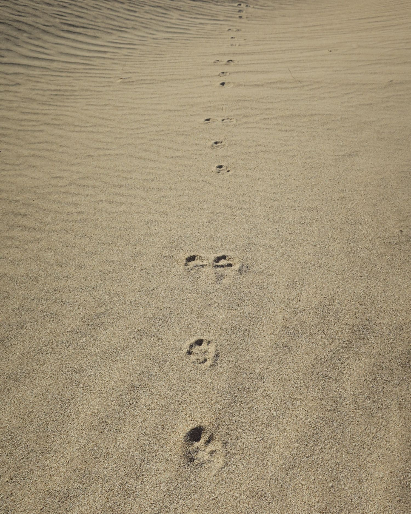
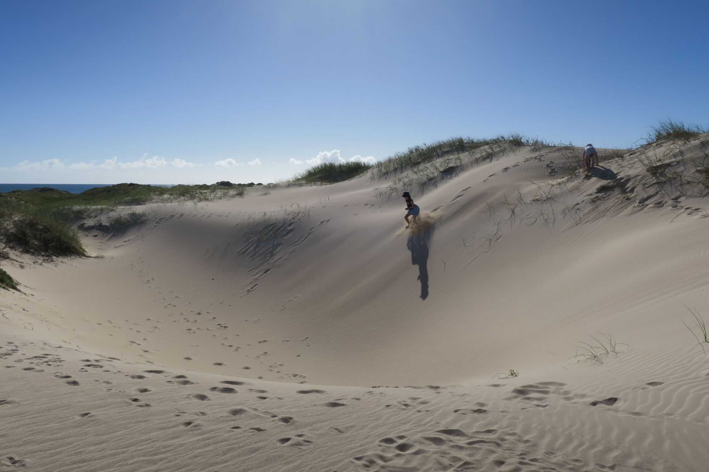
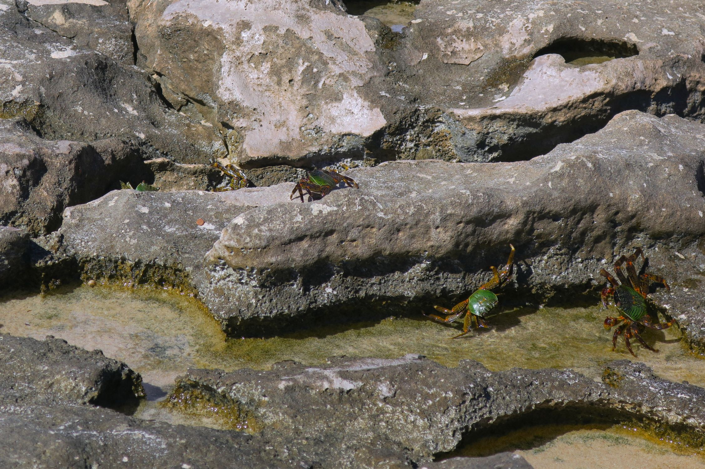
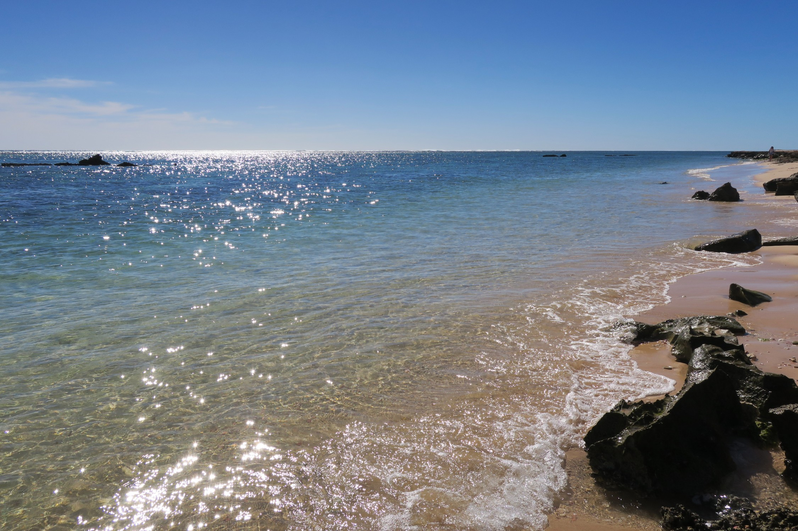
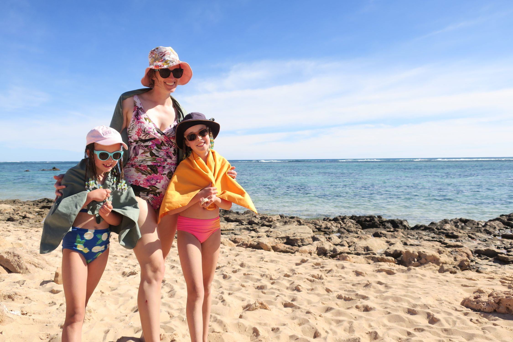
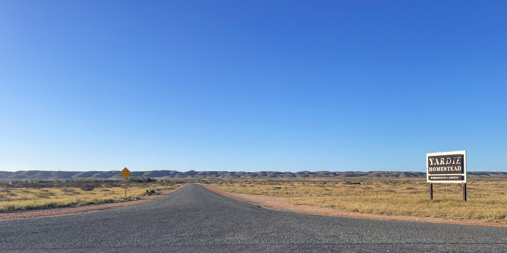
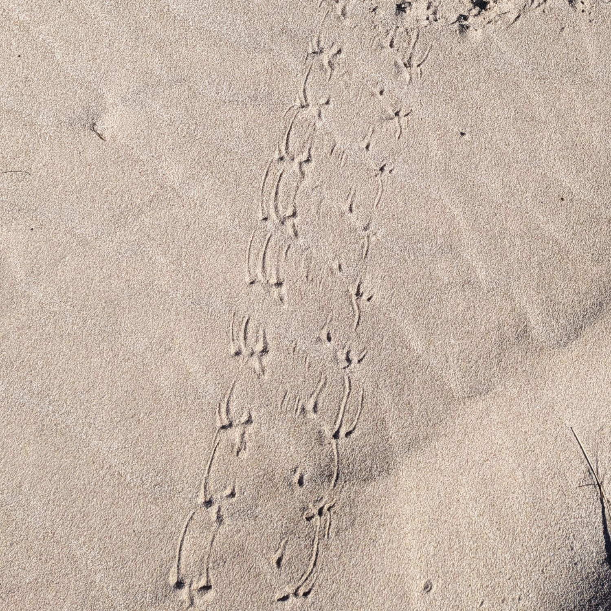

We started Tuesday with a wander from the homestead to the beach, about 2.5km away. For a short walk there was a lot to see. We spotted heaps of animal tracks. The dingos were the easiest to identify. Another type kept us curious for some time - a few birds walking together? A reptile? Violet followed some to their terminus at a hole in the sand cluing us in that they belonged to crabs. A bit of Google research told us they were golden ghost crabs, adorable little fellows who are responsible for destroying or interfering with about 3 quarters of the turtle nests up here. We were at a turtle nesting beach, so the excess of crab tracks make perfect sense. 

*We never figured out who owned these tracks*

There were drifts of shells and coral and we wondered whether it was washed up in the cyclone, or if this used to be part of the reef. We reached a huge abandoned white sand beach. The adults sat on the top of a dune and enjoyed the serenity while the girls built a sand city that was tragically destroyed by waves intermittently. Eventually we wandered back, chatting about cow farts and why dairy cows have a smaller carbon footprint than meat cattle. 

*Move over Tony Hawk*

We packed our lunch and headed to the info centre to ask where to go snorkeling with kids. We spotted the info centre from the road some kilometres out, but when we got there we found the building had been damaged in the cyclone, and a temporary info centre was running out of shipping containers. Needs must! They had it put together pretty well, and informed us the lack of printed park pass was no problem as long as it was on our phone (phew) and advised us on snorkeling spots - Oyster Stacks was the winner. They had a table letting us know the safe time to swim to avoid low tide. Swimming at low tide puts you closer to the coral, but significantly increases the risk of damaging the coral with fins. 

*Crabs!!!*

10 minutes down the road, Osyter Stacks was packed. We were lucky to find a front row park as someone left. We wandered a little way south on the beach to find a sandy entry spot. There was a current that took us gradually south, so we exited, walked back up the beach, and drifted again. The kids had a few issues with goggles flooding, snorkels going underwater, fins coming off, but each run was smoother than the last. On our last go before the tide got too low a huge school of fish surprised everyone when they swam right in front of Violet and Mum, and directly into Pat and Margot. 

*Another lovely beach*

Seeing the crowd quickly disappear at the low tide was a nice reminder that humans can be decent. Only two lone snorkelers continued past the cutoff. Overall, Oyster Stacks was a great choice for the kids - plenty to see, quite easy, and shallow enough for the adults to stand and help the kids with their gear as needed. 

Favourite Things:

**Vi**  -  Eel, blue and brown starfish, school of fish 

**Margot** - All the fish, they're really cute. 

**Pat** - Getting caught in a school of fish, little blue fish

**Kate** - Various rainbow parrot fish, a jellyfish that almost hit Violet in the face before she noticed it, and a tube fish Margot showed her. 

*Road to Nowhere (and our accommodation)*

*Beautiful destructive crab tracks*