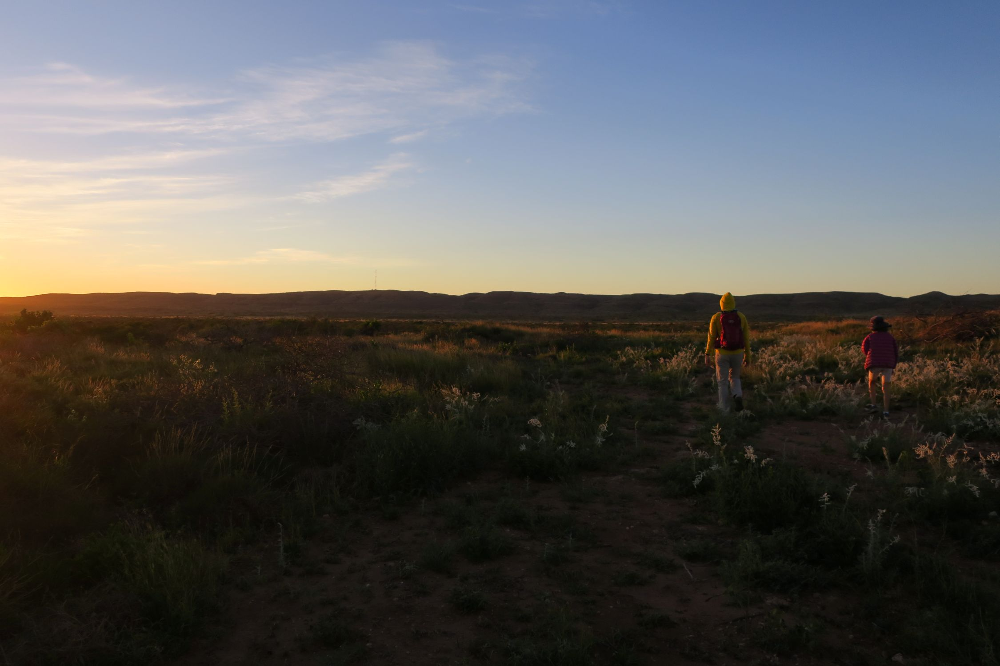
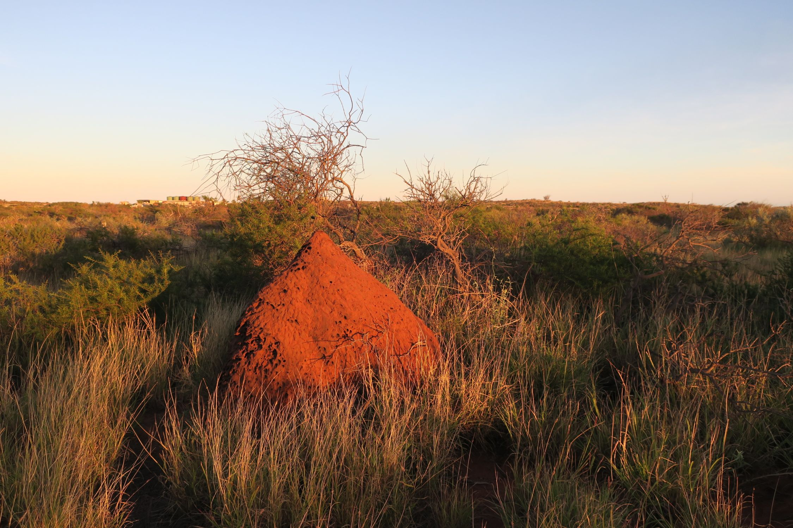
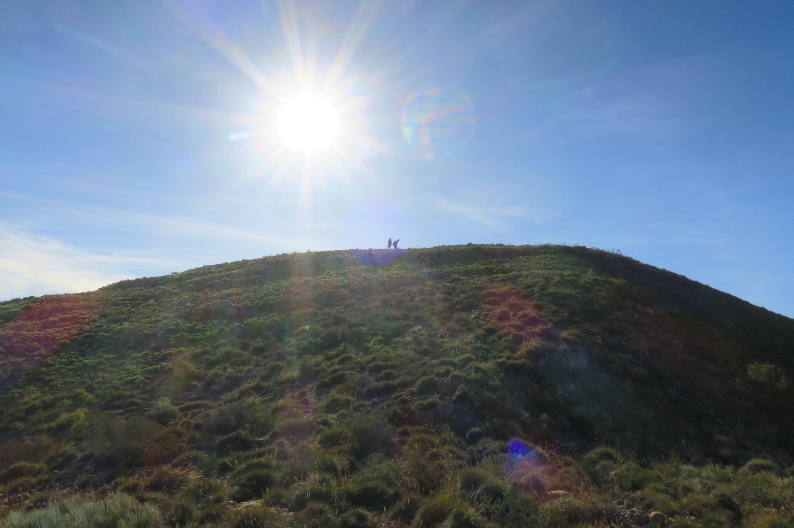
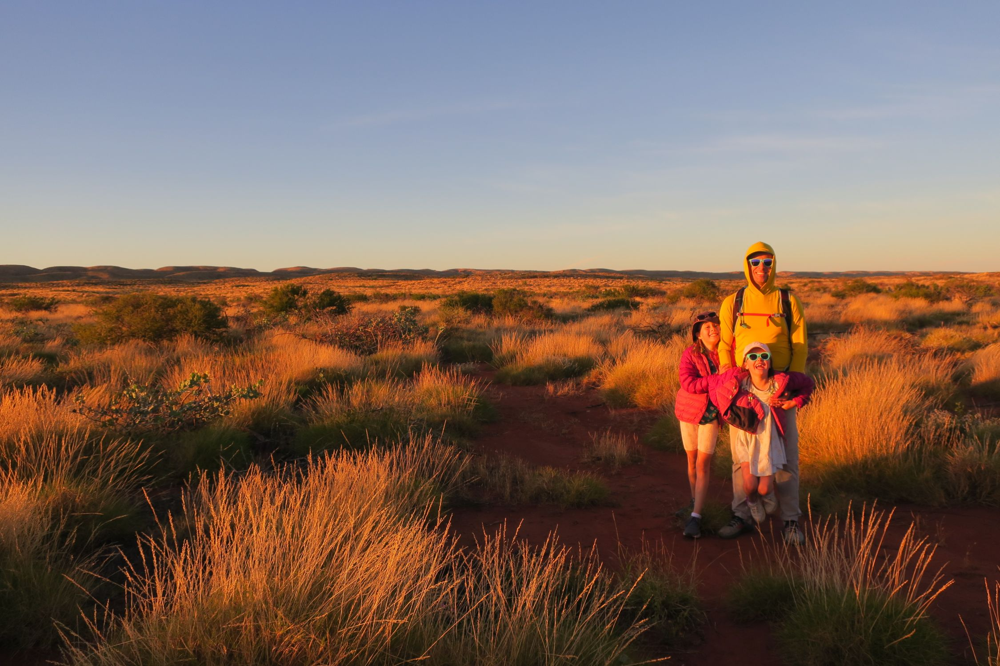
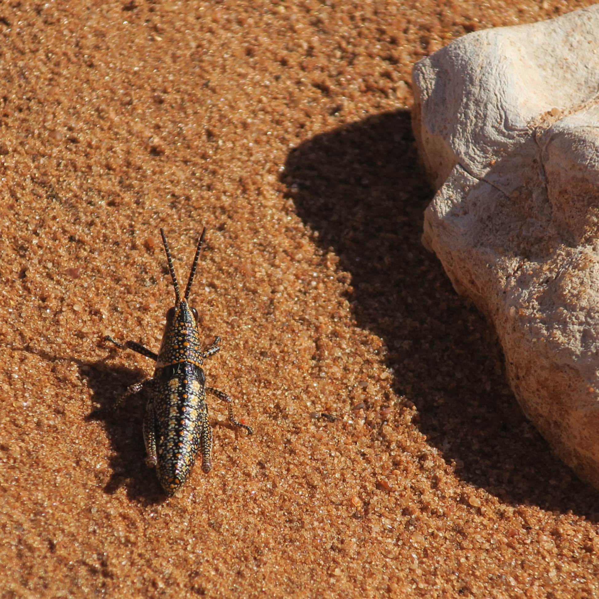
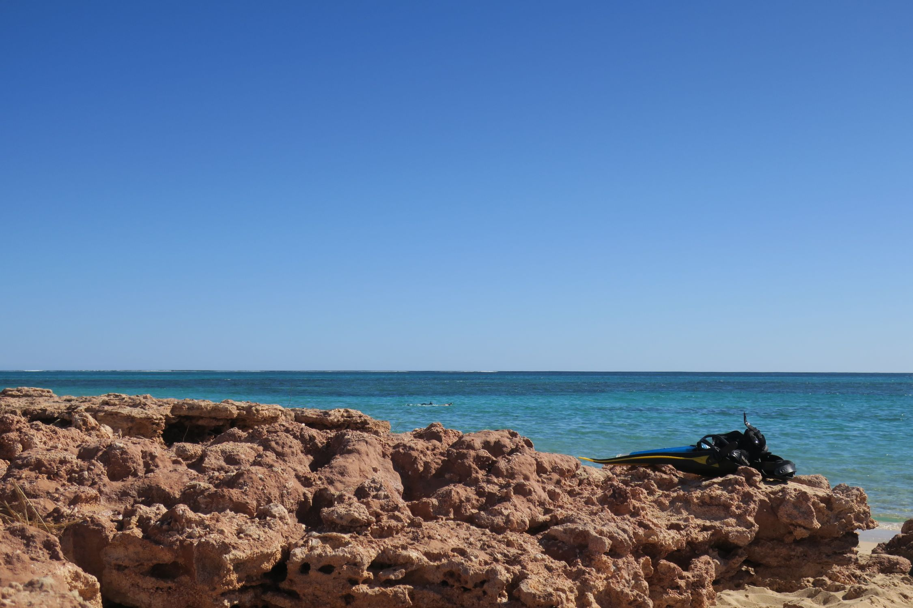
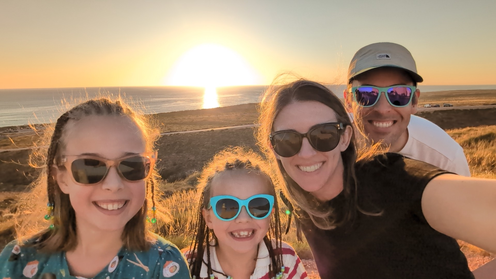
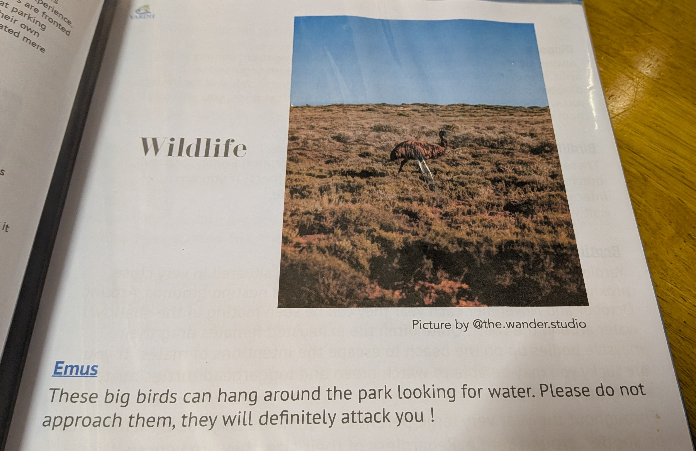

Today we'd hoped to do the Badjirrajirra Walk, but it's closed from cyclone damage. Instead, we went for a walk starting at the homestead heading 5.5km inland to the top of the mountain range. The kids were not super keen on yet another walk, but being the cruel parents we are, we paid them no mind and set off at dawn. The light as the sun started to rise made the scenery look fantastic. The trail itself was sporadically marked and hard to follow. For a while we followed a set of tyre tracks through the spiky spinifex but eventually that gave way to a meandering path marked by the occasional cairn to let you know you were still on the right track. Amusingly, the trail started with a sign advising people this was a walking trail and to “keep left”, presumably to allow other hikers to pass unimpeded. Over the course of three plus hours we saw exactly zero other people, and based on the general wear and tear of the trail we guess there might be one or two groups of people taking it each week. 

*The sun is almost up! Totally reasonable time of day to set off into the wilderness. These kids...*

Along the way, we spotted some interesting sun-bleached snail shells, some quartz, the aforementioned cairns (which the kids enjoyed adding to) and heard plenty of birds chirping. Margot was chuffed that she was allowed to scream “potato” as loud as she could. The word was chosen because we all agreed that anyone who heard it was unlikely to think there was an actual emergency. To keep her mind from focusing on the walk, Margot retold the Trolls movie scene by scene. Surprisingly, she’d only seen the movie once before and was somehow already able to effectively able to quote the whole thing.

*These nests grow by 2-3cm each year, this was over 2 meters high*

After reaching the high point of the walk, the trail on our GPS encouraged us to keep going for another 500m or so along the trail. So on we walked, assuming there must be some kind of view point or other natural turnaround spot behind the hill. Nope. It just kind of ended behind the hill at a spot that was not particularly notable or remarkable. We turned around and went back to the high point on the trail and decided to bush bash our way to the adjacent peak. If the trail wasn’t going to take us to a view point we’d find our own way there, dammit!

*King of the mountain!*

Continuing our conversation from yesterday, Violet asked about overpopulation. Are there too many people for the planet? This got us onto a thought exercise - imagine you live alone in a one bedroom apartment with an ensuite. No dramas! Toilet when you want and shower for as long as you want. Next, imagine there's 20 people in the apartment. You can all probably survive with one bathroom, but a lot more sharing and personal sacrifice is required. Whether there are too many humans depends on how happy we are to share available resources. 

Then consider - if everyone's now living in the one apartment, what about the 19 apartments they vacated to live in the one squeezy apartment? Is there extra space now available for animals and nature from those 19 people, or do we fill each of their apartments with another 20 people? Do we determine whether the planet is overpopulated with humans based only on whether it can sustain us, or whether it can sustain other life? This kept the kids busy too. 

*We should take all our photos at sunrise*

Back to the walk - one other odd observation is that we didn’t see any wildlife aside from the occasional bird. We expected to see kangaroo and perhaps an emu (given the warnings about emu at the caravan park). Maybe they didn’t like Trolls? Maybe screaming 'potato' put them off? The most exciting creature we came across was a delightfully spotted and striped cricket who patiently stood still and let Kate get just the right picture before hopping away.

*Hoppy*

Lunch, then down to Osprey Bay, Bini hyped it up as turtles central. Not a great success for Margot who was not in the mood to wear her mask and snorkel and only lasted 5 minutes in the water. Kate sat out with her while Vi and Pat went back in. 

With Kate and Margot sitting on the beach for this round, Pat took Vi out in search of turtles. We ventured out to the north spying jellyfish and lots of small colourful fish swimming around. Violet was content to hold my hand while we were swimming which made it a very stress free swim; no need to worry about whether she’d been swept out to sea! After 15-20 minutes of floating around with no turtles sighted, Pat noticed that Vi was starting to shiver and started swimming back to the beach.

Pat decided to have one last go at finding a turtle before we called it a day at Oyster Bay. Heading south from the beach he was immediately vindicated and spotted a ray swimming along with a couple smaller fish latched on for the free ride. Further south, paydirt! A beautiful turtle swimming along the sea grass and stopping to munch on the grass periodically. The turtle didn’t seem bothered by Pat hovering nearby watching it eat. Finally deciding that no one really likes to be stared at while they’re eating, Pat floating on down the reef. On the rest of his swim, Pat spotted 3 more turtles (including one who kept poking his little head out of the water to see what was happening), a brilliant opalescent rainbow fish, more rays, heaps of tiny fish hiding under rock ledges, parrot fish, and some fish that can only be described as triangles with fins. 

*Hi Pat!*

When Pat returned with his turtle report, Kate and Vi went back in to look for them while Pat sat with Margot. Sadly we couldn't figure out where Pat wanted us to go once in the ocean, Kate's ocean navigation skills are definitely lacking. It was still a fun swim - we saw a ray hiding in the sand, a gang of colourful fish eating a jellyfish as it floated on the current, and got stuck inside another school of massive fish. 

Maybe the names of some of the cool looking fish we saw:

* Blackback Butterflyfish
* Roundhead Parrotfish
* Palenose Parrotfish
* Lagoon Triggerfish

*Finished the day with a sunset at the lighthouse*

*The homestead info on emus. #1 ahead of snakes and spiders on the danger scale*