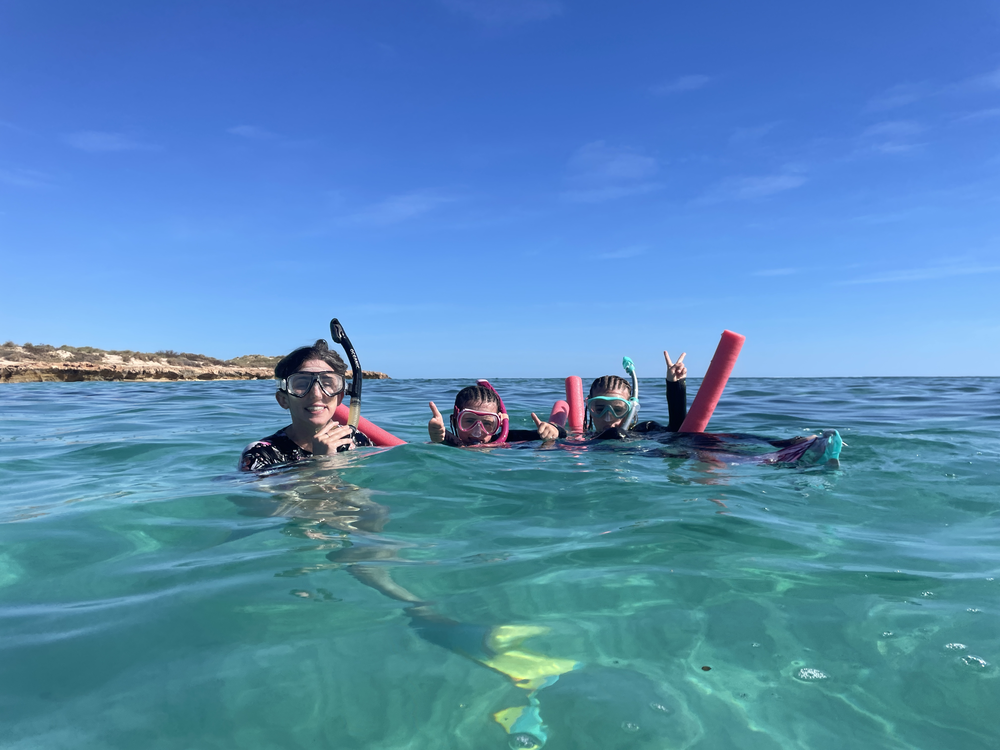
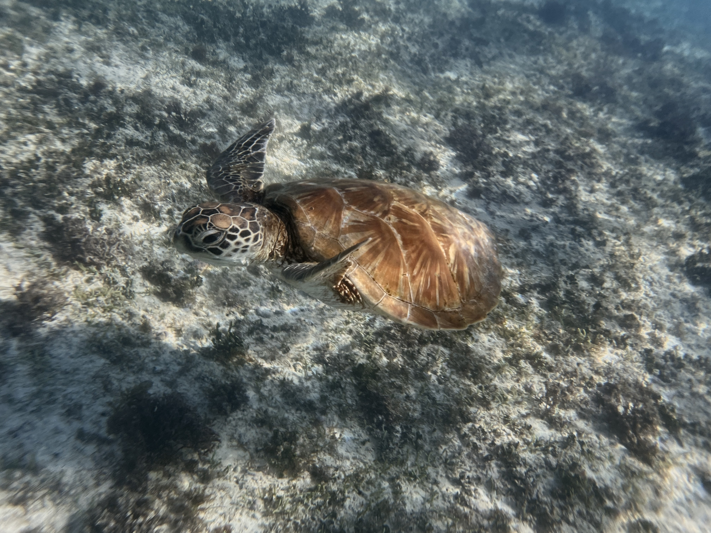
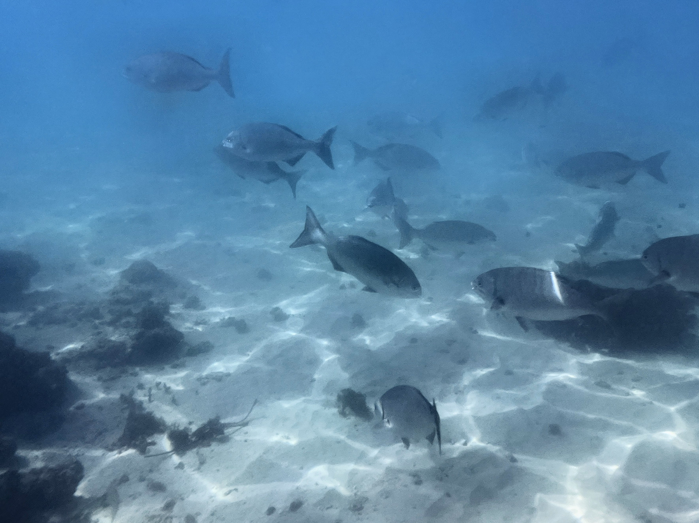
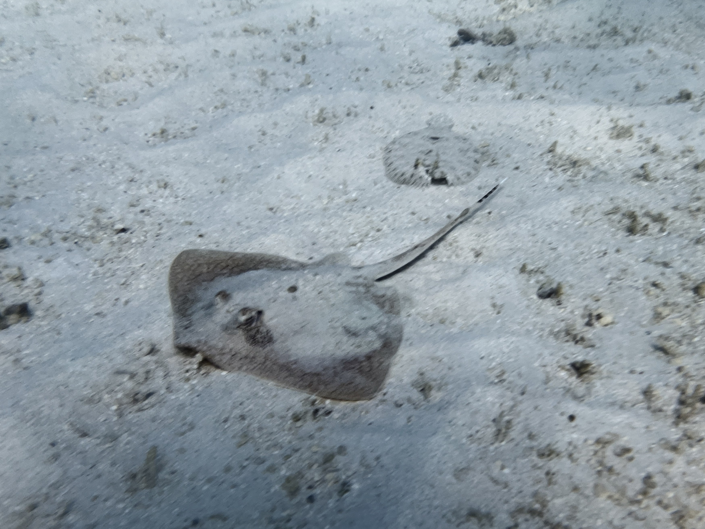
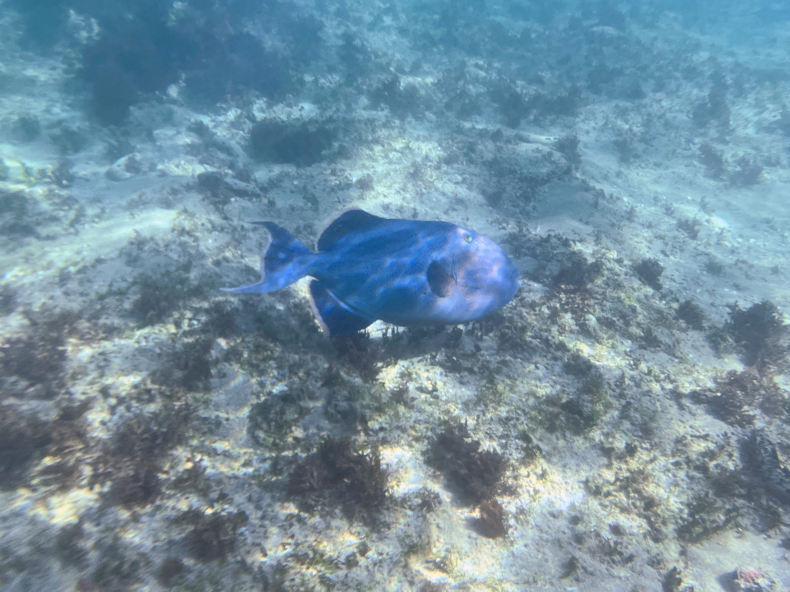
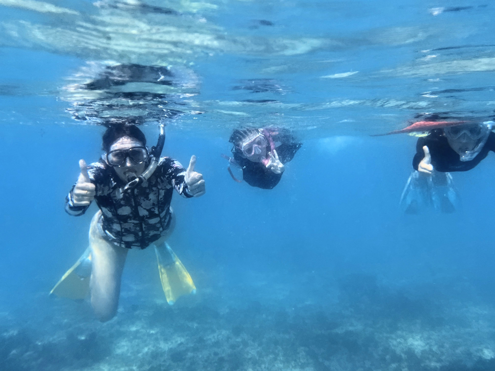
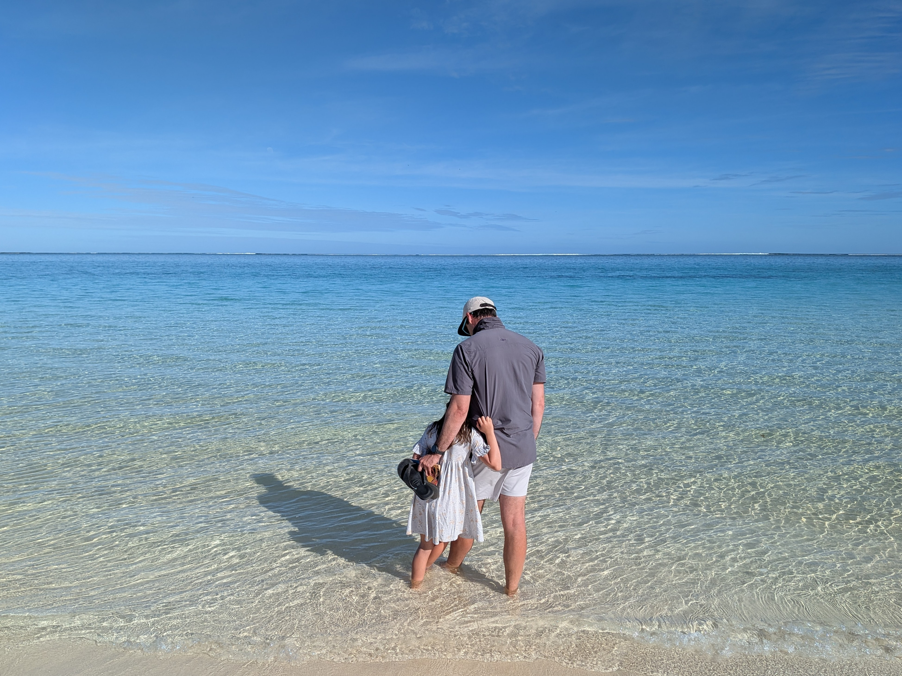
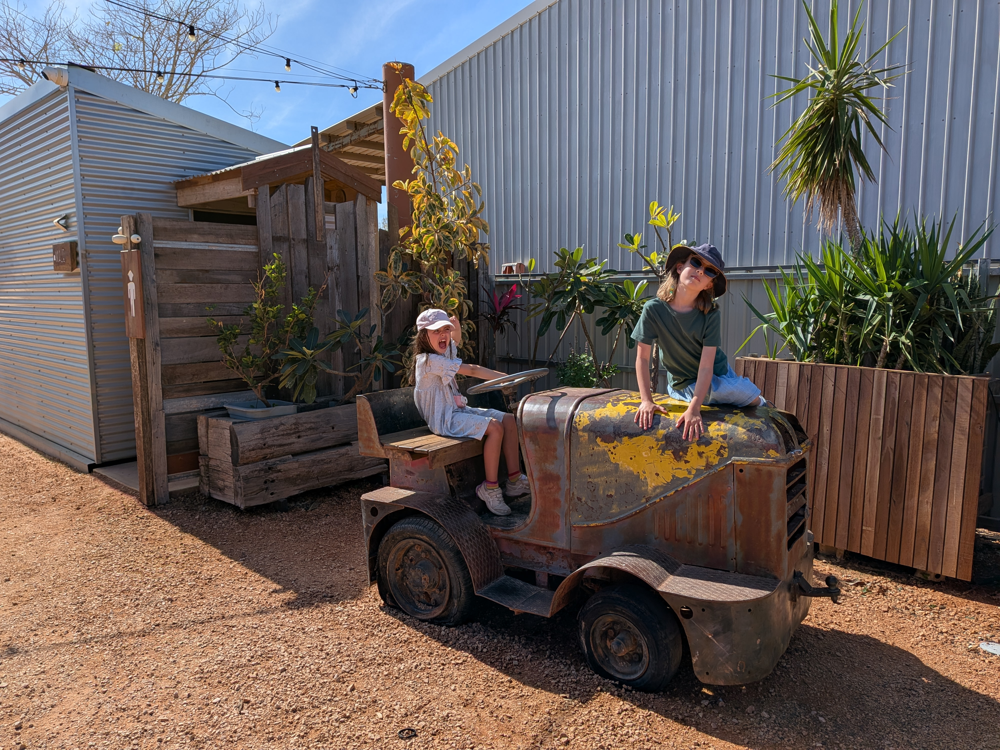
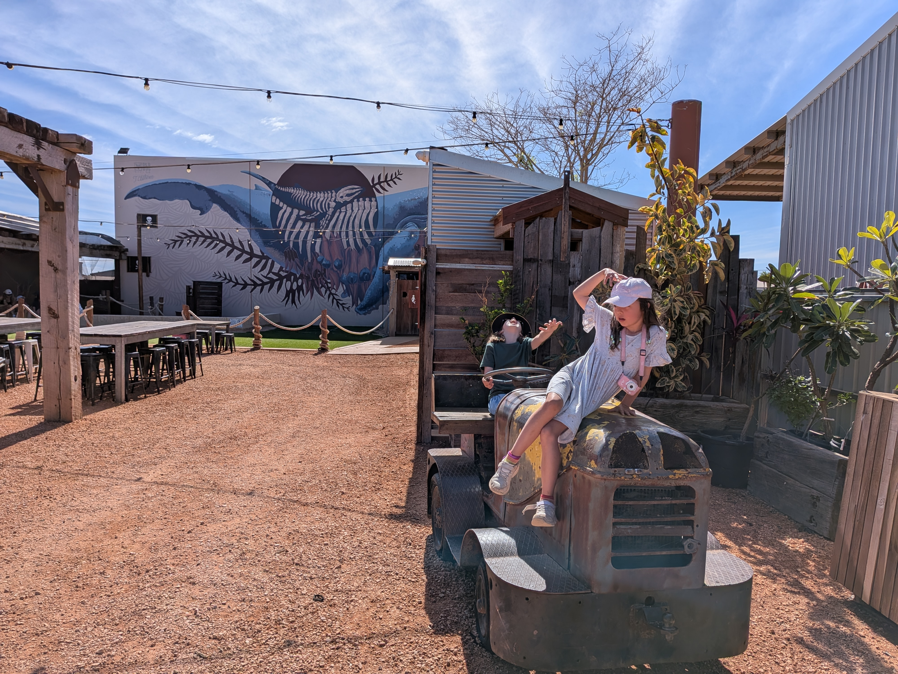
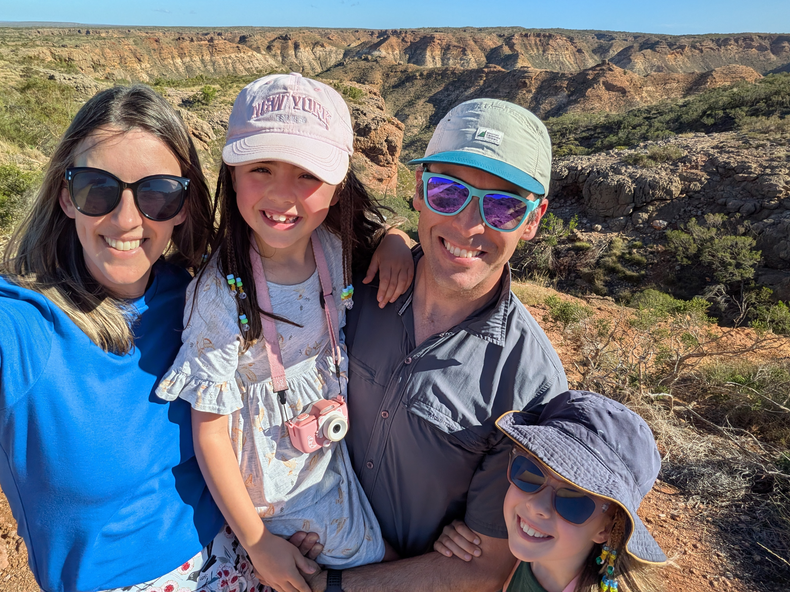

Thursday was penciled in for chores and errands. Wash clothes, IGA run, rent wetsuits (the cold has been a major limiting factor for the girls' snorkel endurance), petrol, and a sneaky lunch at the second craft brewery (Whalebone Distillery). 

'Failiture' (as the girls say). We didn't have coins for the laundry and had to wait 2 hours for reception to open to get some. Then we didn't have enough pegs for everything and just crossed our fingers our clean clothes wouldn't get blown into the red dust while we were in Exmouth. In Exmouth we found the whole town was without power for repairs after the cyclone. Most of the shops and both breweries were closed. Everyone in town was lunching at the bakery which mysteriously still had power (generator perhaps?). After refueling the car, we joined them to refuel ourselves. 

With some local advice we found somewhere to borrow wetsuits for the kids, and then managed to get a waterproof phone case. 

*No leaks yet!*

Suited up, we headed back to Osprey Bay and managed a much longer snorkel. Everyone saw a turtle! We finally figured out what rules and expectations were achievable for the kids and they were excellently behaved. 

*Vi liked - The turtle*

*Margot liked - School of fish*

*Dad liked - Flat sand fish...*

*And the groper*

Kate can see that in many ways, it would have been better to end the week looking for whalesharks after the kids had built confidence with all these reef snorkels, and after we'd established expectations about acceptable behaviour in the ocean. That said, it did make sense to book it at the start of the week and leave the opportunity for a makeup tour if weather had forced ours to be cancelled. One day of tours was cancelled during our stay so it absolutely happens, and if we'd missed out altogether we'd have been pretty upset.

*Mum liked everyone listening and no one drowning*

On our final day the kids were not in the mood to do anything at all. We went to look at Turquoise Bay and dip our feet in (Violet steadfastly refused and stayed in the car reading). Where the other reef beaches were rocky, this was a white sand beach with a gentle gradient down through sandy shallows with cute fish cutting laps around our feet. The beach was quiet when we arrived at 9.30, but was getting busy when we left at 10.10. Early appears to be the way to go if you want a quiet experience. 

*Enjoying the last bit of serenity before real life restarts*

We'd left this reef until last because it's a drift snorkel - the current pulls you from South to North without any effort. Sounds delightful, but the gentle current ends in a strong rip that drags you all the way out to the deep ocean. You absolutely have to exit at the right point. We could imagine Violet busily looking at a turtle, not noticing us frantically trying to get her attention to swim out, or Margot not having enough kicking power to make it to shore. This morning we watched snorkelers out in the reef and thought the current didn't look too strong; it probably would have been fine. We will definitely come back here if we return to Ningaloo.

Returned the wetsuits and tried Whalebone Brewing again - this time with success. Great outside area for the kids, really nice pizza. Bar staff got a bit archy when asked if the ginger beer was sweet and said there it was not as none of their drinks had added sugar. Kate tried it and found it was, in fact, sweet. A bit of research suggests gingerbeer can't be made without sugar. Oh well. The beer was good tho, so definitely would go back there on our next visit.

*Posers posing at Whalebone*

On the way out of town we headed to the Charles Knife Canyon lookout. Road is closed past the plaque commentating the discovery of oil in this location. Gina would be proud.

Arriving at the airport we learned a bit more about the extent of the damage from the cyclone. Apparently the roof above all the sensitive security screening equipment caved in and completely soaked everything. While they wait for replacement scanners to be delivered and installed, security is being run through the heliport next door. Because every bag has to be opened and each item manually inspected, everyone is strictly limited to a single, small carry on bag. No roller bags. Despite this, security is relatively smooth and quick. We get onto the plane to start the 2 day return trip home, sad to be returning to winter in Canberra, and even sadder to say goodbye to this lovely part of the world.

Things we'd like to go if we come back
* Another boat tour, look for whalesharks but also rays, turtles, general fun stuff
* Turquoise Bay
* Badjirrajirra Walk
* Dark Sky Stargazing

